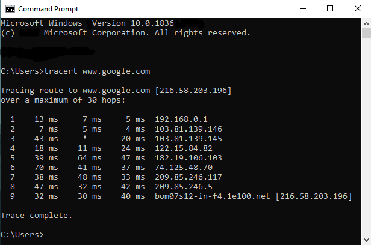
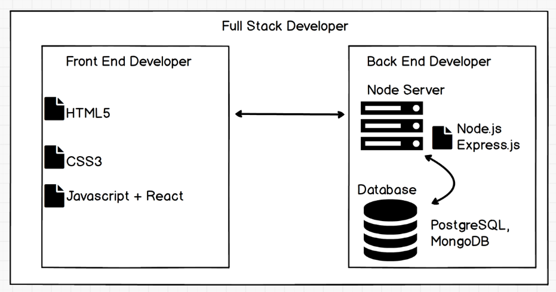
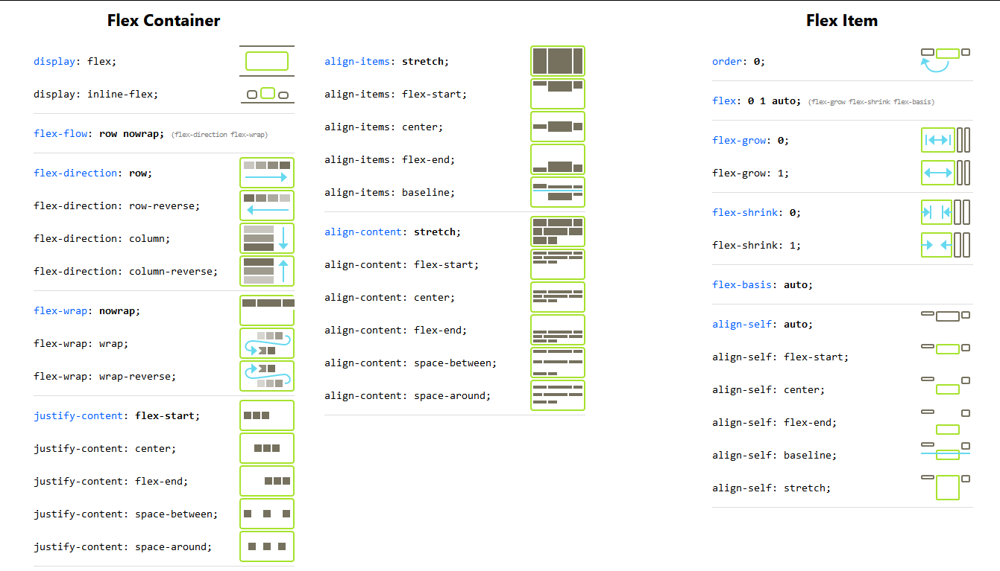
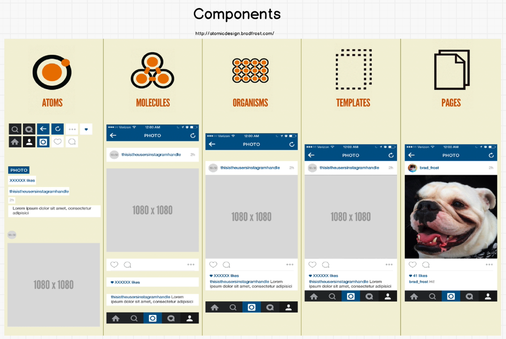

# CWDC-ZTM
All resources and notes from the Complete Web Developer in 2020: Zero to Mastery course

## 	How The Internet Works

Tools:
*	Developer Tools(Inspect Element)

	```
	Cmd Prompt
	tracert                          //generally shows for IPv6
	tracert-4 www.google.com         //Forces IPv4 Hops
	```
	
Topics:
*	ISP, DNS and Servers
*	Traceroute (Windows: tracert)

	__PC>ISP>DNS-->**PC**__
	<br>
	__PC>GOOGLE SERVER --> **Files(html+css+js+...) to PC**__
	
	
	__For Fast Transition between Browser and Google server__
	- Location of Server
	- How many Trips
	- Size of Files(html+css+js ..)
	
	
	
	<div align="center">
	<p><b>Client Side VS Server Side</b></p>
	</div>

*   [Submarine Cable Map](https://www.submarinecablemap.com/)


## 	History Of The Web

*    [Maps that explain the Internet](https://www.vox.com/a/internet-maps)

*    [First Webpage in the world](http://info.cern.ch/hypertext/WWW/TheProject.html)

##### Optional Videos: [Crash Course - Computer Science](https://www.youtube.com/watch?v=tpIctyqH29Q&list=PL8dPuuaLjXtNlUrzyH5r6jN9ulIgZBpdo&index=2&t=0s)


##   HTML 5


Install a text editor (Select one):
*	[sublimetext](https://www.sublimetext.com/)
*	[Atom](https://atom.io/)
*	[VS Code](https://code.visualstudio.com/)

Tags:
*	`<html>`
*	`<head>`
*	`<title>`
*	`<body>`
*	headings (`h1`, `h2`, `h3`, `h4`, `h5`, `h6`)
*	paragraph `<p>`
*	bold `<strong>`, italic `<em>`
*	ordered list `<ol>`, unordered list `<ul>`, list item`<li>`
*	break `<br>`, horizontal rule `<hr>`
*	image `` and attributes: `src`, `width`, `height`
*	anchor `<a href="">`

Topics:
*	Relative vs Absolute Path

Reference websites:
*	[W3 Schools](https://www.w3schools.com/)
*	[MDN Web Docs](https://developer.mozilla.org/en-US/)
*	[StackOverFlow](https://stackoverflow.com/)


## Advanced HTML 5


Tags:
*	`<form>`
	*	`method`, `action`
*	`<input>`:
	*	`type`= `"text"`, `"submit"`, `"reset"`, `"email"`, `"date"`, `"radio"`, `"password"`
	*	`required`, `value`, `name`, `min`, `placeholder`
*	dropdown `<select>`
	*	option `<option>`
*	comment `<!-- -->`
*	`<div>` and `<span>`

Semantic Elements
*	`<header>`
*	`<nav>`
*	`<main>`
*	`<footer>`

Topics:
*	Chrome View Source


## CSS

Syntax:
```css
Selector {
	property: value;
}
```

How to:
*	External
	```html
	<link rel="stylesheet type="text/css" href="style.css">
	```
*	Internal
	```html
	<style>
		body {
			background-color: purple;
		}
	</style>
	```
*	Inline
	```html
	<header style="background-color: green;">
	```

Tools:
*	Chrome Inspector
*	Css Minify - Compacting CSS code can save many bytes of data and speed up downloading, parsing, and execution time.

Properties:
*	text-align
*	border
*	background
*	list-style
*	cursor
*	color: html, hex, rgb or rgba

Selectors:
*	`.class`
*	`#id`
*	`*` (all elements)
*	`element`
*	`element, element`
*	`element element`
*	`element > element`
*	`element + element`
*	`v:hover`
*	`:last-child`
*	`:first-child`
*	`!important` (not recommended)

Text Properties
*	`text-decoration`
*	`text-transform`
*	`line-height`
*	`font-style`
*	`font-weight`
*	`font-size`
*	`font-family`

Layout Properties
*	`float` and `clear`

Box Model
*	`margin`
*	`border`
*	`padding`
*	`width` and `height`

Sizes
*	`px`
*	`em` and `rem`

Topics:
*	Cascading: Specificity, Importance `!`, Source Order
*	Linking fonts and external stylesheets

Exercises:
*	[Flukeout](https://flukeout.github.io/)

Reference websites:
*	[Css Tricks](https://css-tricks.com/)
*	[Type Terms](https://www.supremo.co.uk/typeterms/)
*	[FlexBox - Css Tricks](https://css-tricks.com/snippets/css/a-guide-to-flexbox/)
*	[Unsplash - free usable images](https://unsplash.com/)
* 	[Css Cascade&Inheritance - MDN Web docs](https://developer.mozilla.org/es/docs/Learn/CSS/Introduction_to_CSS/Cascada_y_herencia)
*	[Specificity Calculator](https://specificity.keegan.st/)

Website for color check:
*	[Paletton](http://paletton.com/)
*	[Coolors](https://coolors.co/)

Website for fonts download:
*	[Google Fonts](https://fonts.google.com/)


## Advanced CSS

Flexbox
*	`display: flex`
*	`flex-direction`
*	`flex-wrap`
*	`flex-flow`
*	`justify-content`
*	`align-items`
*	`align-content`
*	`order`
*	`flex`: `flex-grow`, `flex-shrink` and `flex-basis`
*	`align-self`

Properties
*	`transition`
*	`transform`
*	`box-shadow`



Tools
*	Chrome Toggle Device
*	[CodePen](https://codepen.io/)

Exercises:
*	[Flexboxfroggy](http://flexboxfroggy.com/)

Reference websites:
*	[Can I use](https://caniuse.com/)
*	[Browser Support - W3Schools](https://www.w3schools.com/cssref/css3_browsersupport.asp)
*	[Should I Prefix](http://shouldiprefix.com/)
*	[CSS Transitions and Transforms for Beginners](https://robots.thoughtbot.com/transitions-and-transforms)


## Bootstrap 4 & Templates

### [Bootstrap](https://getbootstrap.com/) : Search for Documentation

App for creating users list:
*	[MailChimp](https://mailchimp.com)


Website with animation examples(Generating animated patterns):
*	[Animate.Css](https://daneden.github.io/animate.css)

Website for patterns + Templates:
*	[Creative Tim - bootstrap themes](https://www.creative-tim.com/bootstrap-themes/ui-kit?direction=asc&sort=price)
*	[MashUp](http://mashup-template.com/templates.html)
*	[Startbootstrap](https://startbootstrap.com/template-categories/all/)
*	[Mdbootstrap](https://mdbootstrap.com/freebies/)
*	[Creative Tim](https://www.creative-tim.com/)

Installing Github:
*	[Github Desktop](https://desktop.github.com/)


## 	CSS Grid + CSS Layout


Cheat Sheet:
*	[Grid Malven](http://grid.malven.co/)
*	[Media Queries](https://css-tricks.com/snippets/css/media-queries-for-standard-devices/#phone-queries)
	* Example
```css
@media only screen and (max-width : 600px){
    .main-nav{
        font-size: 0.5em;
        padding: 0;
    }
}
```
**Normalize css** - provides better cross-browser consistency in the default styling of HTML elements.\
**Viewport Height `(vh)`** — This unit is based on the height of the viewport. A value of 1vh is equal to 1% of the viewport height.

Exercise:
*	[Grid Garden](https://cssgridgarden.com/)

Free Design & Illustration resources:
*	[Interfacer - high quality free design resources](https://interfacer.xyz/)
*	[Undraw - Open-source illustrations](https://undraw.co/)


## Javascript

**JAVASCRIPT TYPES**
1. Number
```
> 10 + 2    //expression
> 12
---
> 10 - 2
> 8
---
> 2 * 2
> 4
---
> 10 / 2
> 5
---
> 10 % 3
> 1
---
> 5 % 10 
> 5
```
2. String
```
> "Hello" + "world!"
> "Helloworld1
---
> "Hello " + "world!"
> "Hello world1
---
> 'This isn\'t very nice'
> "This isn't very nice"
---
> 10 + "34"
> "1034"
---
> 10 - "7"
> 3
> "hello" - "bye"
> NaN     //means not a number
```
3. Boolean
```
> true
> false
---
> 3 > 2
> true
---
> 5>=5
> true
---
> 5<=5
> true
---
> 3 = 3
X error
---
> 3 === 3
> true
---
> 3!==3
> false
```
```
true + true    //  2
true + false   //  1
false + true   //  1
false - true   //  -1
"A" > "B"      //  false
"B" < "C"      //  true
"a" > "A"      //  true
"b" < "A"      //  false
```
4. Undefined
```
> var c;
___________
> c
> undefined
```
>JavaScript assigns 'undefined' to any object that has been declared but not initialized or defined. In other words, in a case where no value has been explicitly assigned to the variable, JavaScript calls it 'undefined'.
5. Null
6. Symbol (new in ECMAScript 6)
7. Object
  > `clear()` to clear up the console

**JAVASCRIPT COMPARISONS**
`!==`
`===`
`>=`
`<=`
`>`
`<`

**JAVASCRIPT VARIABLES**
* `var`
* `let` (new in ECMAScript 6)
* `const` (new in ECMAScript 6)

**JAVASCRIPT CONDITIONALS**
`if`
`else`
`else if`
`ternary operator`  // condition ? exp1 : exp2;
`switch`


**JAVASCRIPT LOGICAL OPERATORS**
`&&`
`||`
`!`

**JAVASCRIPT FUNCTIONS**
```javascript
var a = function name() {};   //function expression
---------------
function name() {}            //function declaration
return
---------------
function name(parameter) {
console.log("name is :" + parameter);
}

name("steve");                //to call a function
name("Rob");
---------------
<!-- () => (new in ECMAScript 6) -->
```
> `console. log()` is a function in JavaScript which is used to print any kind of variables defined before in it or to just print any message that needs to be displayed to the user.

**JAVASCRIPT DATA STRUCTURES**
* Array
* Object

**Array methods**

|Method 	|Description|
|-|-|
|concat()| 	Joins two or more arrays, and returns a copy of the joined arrays|
|copyWithin()| 	Copies array elements within the array, to and from specified positions|
|entries()| 	Returns a key/value pair Array Iteration Object|
|every()| 	Checks if every element in an array pass a test|
|fill()| 	Fill the elements in an array with a static value|
|filter()| 	Creates a new array with every element in an array that pass a test|
|find()| 	Returns the value of the first element in an array that pass a test|
|findIndex()| 	Returns the index of the first element in an array that pass a test|
|forEach()| 	Calls a function for each array element|
|from()| 	Creates an array from an object|
|includes()| 	Check if an array contains the specified element|
|indexOf()| 	Search the array for an element and returns its position|
|isArray()| 	Checks whether an object is an array|
|join()| 	Joins all elements of an array into a string|
|keys()| 	Returns a Array Iteration Object, containing the keys of the original array|
|lastIndexOf()| 	Search the array for an element, starting at the end, and returns its position|
|map()| 	Creates a new array with the result of calling a function for each array element|
|pop()| 	Removes the last element of an array, and returns that element|
|push()| 	Adds new elements to the end of an array, and returns the new length|
|reduce()| 	Reduce the values of an array to a single value (going left-to-right)|
|reduceRight()| 	Reduce the values of an array to a single value (going right-to-left)|
|reverse()| 	Reverses the order of the elements in an array|
|shift()| 	Removes the first element of an array, and returns that element|
|slice()| 	Selects a part of an array, and returns the new array|
|some()| 	Checks if any of the elements in an array pass a test|
|sort()| 	Sorts the elements of an array|
|splice()| 	Adds/Removes elements from an array|
|toString()| 	Converts an array to a string, and returns the result|
|unshift()| 	Adds new elements to the beginning of an array, and returns the new length|
|valueOf()| 	Returns the primitive value of an array|


**JAVASCRIPT LOOPING**
* `for`
* `while`
* `do` 
* `forEach` (new in ECMAScript 5) 

**JAVASCRIPT KEYWORDS**
`break`
`case`
`catch`
`class`
`const`
`continue`
`debugger`
`default`
`delete`
`do`
`else`
`export`
`extends`
`finally`
`for`
`function`
`if`
`import`
`in`
`instanceof`
`new`
`return`
`super`
`switch`
`this`
`throw`
`try`
`typeof`
`var`
`void`
`while`
`with`
`yield`

**JAVASCRIPT POPUP BOXES**
`prompt`
`alert`

**DRY** - *Do not Repeat Yourself*


## DOM Manipulation
When a web page is loaded, the browser creates a Document Object Model of the page.  

*	`document.write()`
*	`window.alert()`

**DOM Selectors**

*	`getElementsByTagName`
*	`getElementsByClassName`
*	`getElementById`

*	`querySelector`
*	`querySelectorAll`

*	`getAttribute`
*	`setAttribute`

```javascript
/* Example */
---------------
document.querySelector("li").getAttribute("random");
---------------
document.querySelector("li").setAttribute("random","1000");
```
**Changing Styles**
*	`style.{property}` //ok

*	`className` //best
*	`classList` //best

	*	`classList.add`
	*	`classList.remove`
	*	`classList.toggle`
	
```javascript
document.querySelector("li").classList.toggle(  "classname"  );
```

**Bonus**
*	`innerHTML` //DANGEROUS

*	parentElement
*	children

```javascript
document.querySelectorAll("li")[1].parentElement.parentElement.children;
```

> It is important to CACHE selectors in variables
```javascript
var h1 = document.querySelector("h1");
//anytime user need to use h1, the browser doesn't have to look to DOM find h1 then store in the memory.
```

**Events**
*	`<Button>`
*	`addEventListener`
	*	`click`
	*	`mouseenter`
	*	`mouseleave`
*	`document.createElement("li")`

```javascript
//Example
var button = document.getElementById("enter");
var input = document.getElementById("userinput");
var ul = document.querySelector("ul");

button.addEventListener("click", function() {
	if(input.value > 0) {
		console.log(input.value);
		var li = document.createElement("li");
		li.appendChild(document.createTextNode(input.value));
		ul.appendChild(li);
		input.value = "";
	}
)};	
```


Reference websites:
*	[Event reference](https://developer.mozilla.org/en-US/docs/web/Events)
*	[Javascript Char Codes -Key Codes](https://www.cambiaresearch.com/articles/15/javascript-char-codes-key-codes)
*	[JQuery](https://jquery.com/)
*	[you might not need jquery](http://youmightnotneedjquery.com/)
*	[Babel - JavaScript compiler](https://babeljs.io/)

**Declarative programming** is a programming paradigm … that expresses the logic of a computation without describing its control flow.  
**Imperative programming** is a programming paradigm that uses statements that change a program’s state.

## 	__Advanced Javascript__

**Scope**
```javascript
//Root Scope(window)
var fun = 5;
function funestFunction(){
	//child scope
	console.log(fun);
}
```


```javascript
var globVar = "Hi";    //Global Scope[Exists everywhere]

function test () {
	var localVar = "Bye";   //Function Scope[Exists inside function only]

	console.log(globVar);   //Hi
	console.log(localVar);  //Bye

	function inside () {
		console.log(localVar);    //Lexical Scope[child function able to access parent variables]
	}

	for(let i=0; i<3; i++) {    //Block Scope[Exists only in block of code]
		console.log(globVar);   //Hi
		console.log(localVar);  //Bye
		console.log(i);  // 0, 1, 2
	}
	console.log(i);  //ERROR
}

console.log(globVar);  // Hi
console.log(localVar); //ERROR
console.log(i);  //ERROR

/*
__Local scope__
Anything that is not global is considered local, but subjective.  
*	var localVar is local variable of function test()
*	let i=0 is local variable of the block itself, it is not a local variable of function test()
*/
```

* ECMAScript6 and Javascript
> JavaScript is a language based on ECMAScript. A standard for scripting languages like JavaScript, JScript is ECMAScript. JavaScript is considered as one of the most popular implementations of ECMAScript.

*	let + const
```javascript
const player = 'booby';  //const variable cannot be reassigned
	// if using a variable that doesn't change probably use const ; otherwise use let.
let experience = 100;
let wizardLevel = false;

if(experience > 90) {
	let wizardLevel = true;
	console.log('inside', wizardLevel);  //inside true
}

console.log('outside', wizardLevel);         //outside true
```

*	Destructuring
```javascript
const obj = {
	player: 'bobby';
	experience : 100;
	wizarLevel : false
}
/*
const player = obj.player;
const experince = obj.experience;
let wizardLevel = obj.wizardLevel;
*/
// Below is same as above
const{player, experience } = obj;
let {wizardLevel } = obj;
```

*	Object Properties
```javascript
const a = "simon";
const b = true;
const c = {};
/*
const obj = {
	a:a, b:b, c:c
}
*/
const obj = {
	a, b, c
}
/*sometime you want properties to match the value. if property and value are same you can do this*/
```

*	Template strings
```
>	const name = "Sally";
	const age = 34;
	const pet = "horse";

	/* const greetingBest = "Hello " + name + " you seem to be doing " + greeting + "!" */

	const greetingBest = `Hello ${name} you seem to be ${age-10}. What a lovely ${pet} you have`
	
-------------------------------------------
>	greetingBest
//	"Hello Sally you seem to be 24. What a lovely horse you have"
```

*	default arguments
```javascript
function greet(name='', age=30, pet ='cat'){
	return `Hello ${name} you seem to be ${age-10}. What a lovely ${pet} you have.`
}
/*
>	greet()
<-	Hello  you seem to be 20. What a lovely cat you have.
-------------------------------------------------------------
>	greet(name='john', age=30, pet ='cat');
<-	Hello john you seem to be 20. What a lovely cat you have.
*/
```

*	Symbol
```
//symbols are used because they create unique identity, so you could be sure that there is no conflict.
>	let sym1 = Symbol();
	let sym2 = Symbol('foo');
	let sym3 = Symbol('foo');
-------------------------------------------
>	sym1
//	Symbol()
-------------------------------------------
>	sym2
//	Symbol(foo)
-------------------------------------------
>	sym3
//	Symbol(foo)
-------------------------------------------
>	sym2 === sym3
//	false
```

*	arrow function
```
>	function add(a, b) {
		return a+b;
	}
	//can be written as
	const add2 = (a,b) => a + b;
	/*
	const add2 = (a,b) => {
	return a + b;
	}
	*/
-------------------------------------------	
>	add(4,2);
//	6
-------------------------------------------
>	add2(4,2);
//	6
```

__Advanced function__
```javascript
/*
function first() {
	var greet = 'Hi';
	function second() {
		alert(great);
	}
	return second;
}

var newFunc = first();
newFunc();
*/

const first = () => {
	const greet = 'Hi';
	const second = () =>{
		alert(greet);
	}
	return second;
}

const newFunc = first();
newFunc();
```

Closures  
*child scope always has access to parent scope*  
Closures - a function ran. the function executed. It's never going to be execute again.  
BUT it's going to remember that there are refernces to those variables.  
so the child scope always has access to the parent scope.

Currying  
The process of converting a function that takes multiple arguments into a function that takes them one at a time.  
```
>	const multiply = (a, b) => a * b;
	const curriedMultiply = (a) => (b) => a * b;
-------------------------------------------	
>	curriedMultiply(3);
//	(b) => a * b
-------------------------------------------	
>	curriedMultiply(3)(4);   /*a is 3, b is 4*/
//	12
--------------------------------------------------------------------------------------	
--------------------------------------------------------------------------------------  
>	const curriedMultiply = (a) => (b) => a * b;
	const multiplyBy5 = curriedMultiply(5);
-------------------------------------------	
>	multiplyBy5(5);
//	25
-------------------------------------------	
>	multiplyBy5(11);
//	55

```

Compose  
>act of putting two function together to form a third function where the output of one function is input of another function.  
```
const compose = (f,g) => (a) => f(g(a));
// f(g(a))  ->  f(sum(a))  ->  f(6)  -> sum(6)  ->  7
const sum = (num) => num + 1;

compose(sum, sum)(5);    //7
```

*	Avoiding side Effects, functional purity.   (GOOD PRACTICE)

Q. What are the two elements of a pure function?  
1. Deterministic --> always produces the same results given the same inputs  
2. No Side Effects -->  It does not depend on any state, or data, change during a program’s execution. It must only depend on its input elements.

Advanced Array  
```javascript
const array = [1,2,10,16];
const double = [];
const newArray =array.forEach((num) => {
	double.push(num*2);
})
console.log(double);
// (4)	[2, 4, 20, 32]
```

**map, filter, reduce**  
```javascript
const array = [1,2,10,16];
const double = [];
const newArray =array.forEach((num) => {
	double.push(num*2);
})
console.log('forEach', double);  	// forEach	(4) [2, 4, 20, 32] 
//forEach - just to loop over something and does what function says
//in comparison to map. here, we have to create new array to return. no need to declare array seperately in map.
/*
const mapArray = array.map((num) => {
	return num*2
});
*/
//map - loop over each element and return new array.
const mapArray = array.map(num => num*2);
console.log('map', mapArray);	 	// map		(4) [2, 4, 20, 32]

const filterArray = array.filter(num => num > 5);		
// filter the array where num(respective element in array) is greater than 5
console.log('filter', filterArray);	 // filter	(2) [10, 16]

const reduceArray = array.reduce((accumulator, num) => {
	return accumulator + num
	//**accumulator**  - something where we can store the information that hapens in the body of function.
}, 0); //here 0 means, accumultor to start with a.k.a default value
console.log('reduce', reduceArray);	//reduce 29

```

reference type  
```javascript
var object1 = {value: 10};
var object2 = object1; //object 2 reference object 1
var object3 = {value: 10};

object1 === object2;   // true
object1 === object3;   // false
object1.value = 15;    // 15
object2.value;         // 15
object3.value;         // 10
```

context (vs scope)  -  where we are within object
```javascript
const object4 = {
    a: function() {
        console.log(this);
    }
}

object4.a()   // {a:f}
```

**instantiation**  -  make a copy of object and reuse the code  
> A constructor is a function which is used to create instances, and automatically set their prototype.

```javascript
class Player {
    constructor(name, type) {
        console.log(this);
        this.name = name;
        this.type = type;
    }
    introduce() {
        console.log(`Hi I am ${this.name} , I'm a ${this.type}`);
    }
}

class Wizard extends Player {		//class wizard that extends Player; whenever you extend a class you have to use super
    constructor(name, type) {
        super(name, type)		//takes to the constructor of Player
    }
    play() {
        console.log(`WEEEEEE I'm a ${this.type}`);
    }
}

const wizard1 = new Wizard('shelly', 'Healer');		//makes instance of wizard
const wizard2 = new Wizard('shawn', 'Dark Magic');

/*OUTPUT:
Object { name: "shelly", type: "Healer" }
Object { name: "shawn", type: "Dark Magic" }

>	wizard1.play()
//	WEEEEEE I'm a Healer

>	wizard1.introduce()
//	Hi I am Shelly , I'm a Healer

>	wizard2.introduce()
//	Hi I am Shawn , I'm a Dark Magic 
*/
```

**Pass By value vs Pass By reference**  
```javascript
var a = 5;
var b = a;

b++;

console.log(a);//5
console.log(b);//6

//save space in memory
let obj1 = {name: 'Yao', password: '123'};
let obj2 = obj1;

obj2.password = 'easypeasy';

console.log(obj1);//{name: 'Yao', password: '123'}
console.log(obj2);//{name: 'Yao', password: '123'}

var c =[1,2,3,4,5];
var d =c;
d.push(123);
console.log(d);
console.log(c);

var c =[1,2,3,4,5];
var d =[].concat(c);
d.push(123);
console.log(d);//[1,2,3,4,5,123]
console.log(c);//[1,2,3,4,5]
```

```
//shallow cloning
let obj = {a:'a', b:'b', c:'c'};
let clone = Object.assign({}, obj);
let clone2 = {...obj}; //above clone can also be written as
obj.c = 5;
console.log(clone);   //{a:'a', b:'b', c:'c'}
console.log(clone2);  //{a:'a', b:'b', c:'c'}
console.log(obj);     //{a:'a', b:'b', c:5}

//deep cloning -- can have performance implication if its extremely deep object
let obj = {a:'a', b:'b', c:{ deep : 'try and copy me'}};
let clone = Object.assign({}, obj);
let clone2 = {...obj}; 
let superclone = JSON.parse(JSON.strigify(obj))
obj.c.deep = 'hahaha';
console.log(obj);            //{a:'a', b:'b', c:{ deep : 'hahaha'}
console.log(clone);          //{a:'a', b:'b', c:{ deep : 'hahaha'}
console.log(clone2);         //{a:'a', b:'b', c:{ deep : 'hahaha'}
console.log(auperclone);     //{a:'a', b:'b', c:{ deep : 'try and copy me'}}
```

**TYPE COERCION**  
```javascript
1 == '1' //true
1 === '1' //false
Object.is(-0,+0)//true
NaN === NaN //false
```

**ES7** 
```
const pets = {'cat','dog','bat'};
pets.include('dog');//true
pets.include('bird');//false

const square = (x) =>x**2;  //similarly, x**3 will do cube for this.
square(5);//25
```

**ES8**
*   `.padStart()`
*   `.padEnd()`
```
Turtle.padStart(10);  // "     Turtle"
Turtle.padStart(10);  // "Turtle     "
```

*   Object.values;
*   Object.entries;
*   Object.keys;

```javascript
let obj = {
    username0: 'Santa',
    username1: 'Rudolf',
    username2: 'Mr. Grinch',
}

Object.keys(obj).forEach((key, index) => {
    console.log(key, obj[key]);
})
/*username0 Santa
username1 Rudolf
username2 Mr. Grinch*/

Object.values(obj).forEach(value => {
    console.log(value);
})
/*Santa
Rudolf
Mr. Grinch*/

Object.entries(obj).forEach(value => {
    console.log(value);
})
/*(2) ["username0", "Santa"]
(2) ["username1", "Rudolf"]
(2) ["username2", "Mr. Grinch"]*/

```

**ES10**
*   `.flat()`
```javascript
const array = [1,2,,,,,,,3,4,[5,[6,7]],8];
array.flat(3);      // Array(8) [ 1, 2, 3, 4, 5, 6, 7, 8 ]
```
*   `.flatMap`
*   `.trimStart()`
```
const userEmail3 = '     cannotfillemailformcorrectly@gmail.com   ';
console.log(userEmail3.trimEnd().trimStart());  //cannotfillemailformcorrectly@gmail.com
```
*   `.trimEnd()`
*   `.formEntries()`
```
const users = { user1: 18273, user2: 92833, user3: 90315 }
//Solution
const usersArray = Object.entries(users);
console.log(usersArray); //array: [ [ 'user1', 18273 ], [ 'user2', 92833 ], [ 'user3', 90315 ] ]
```
*   try catch

**Advanced Loops** 
```
const basket = ['apples', 'oranges', 'grapes'];
//for of
//iterating - arrays, strings
for (item of basket) {   //strings: for (item of 'basket') {
    console.log(item);   //apples, oranges, grapes
}

//for in - properties
//enumerating - objects
const detailedBasket = {
    apples : 5,
    oranges : 10,
    grapes : 1000
}
for (item in detailedBasket) {
    console.log(item);  
    /*
    apples
    oranges
    grapes
    */
}
```

*   Debugging `debugger`

**How does Javascript works?**  
*   Terms:
    `Javascript is a single threaded laguage that can be non blocking??`
    `Memory Leak`
    `Call Stack - first in last out`
    `synchronous Programming`
    `Asynchronous Programming`
    `Recursion - function calling itself`
    `.setTimeout()`
    
Modules    
*   Code Reusability
*   Dependency Resolution

**Links**   
*   [Type Coercion Table](https://dorey.github.io/JavaScript-Equality-Table/)  
*   [MDN - Equality comparisons](https://developer.mozilla.org/en-US/docs/Web/JavaScript/Equality_comparisons_and_sameness)  
*   [ECMA - Comparison Algorithm](https://www.ecma-international.org/ecma-262/5.1/#sec-11.9.3)
*   [ES modules: A cartoon deep-dive](https://hacks.mozilla.org/2018/03/es-modules-a-cartoon-deep-dive/)
*   [Modern JavaScript Tutorial](https://javascript.info/)
*   [JavaScript. The Core: 2nd Edition](http://dmitrysoshnikov.com/ecmascript/javascript-the-core-2nd-edition/)


##  __Command Line__


### FOR MAC OR LINUX:


Command | Description
--- | ---
ls  | lists files and folders within working directory
pwd | show current working directory
cd  | change working directory to user directory
cd .. | change working directory to direct parent directory
clear | clear current terminal screen
cd / | change current directory to root directory
cd ~ | change current directory to user directory
cd path/to/folder | changes working directory to specified path
mkdir name | create folder called 'name' within current directory
open foldername | opens folder called 'foldername' using OS GUI
touch index.html | creates new file titled index.html within working directory
open  index.html | opens file named index.html using default system program
open -a “Sublime Text” | opens sublime text program. This syntax can be used to open other programs
open . | opens and displays current folder within OS GUI
mv index.html about.html | renames index.html file to about.html
up and down arrow | cycles through previous commands typed within current terminal session
rm filename | deletes a file called 'filename' within the current directory
rm -r foldername | used to delete folders. In this case 'foldername' will be deleted
say hello (only on Mac) | the mac will speak any text you enter after the 'say' keyword


### FOR WINDOWS:


cmd | What it does
-- | --
dir | list files
cd {directory name} | change directory
cd / | go to root (top) directory
cd .. | go up a level
mkdir {file name} | make a directory
echo > {filename} | create an empty file
del {filename} | remove a file
rmdir {directory name} | remove a directory and all files within
rename {filename} {new filename} | rename a file or folder
start {filename} | open file in default program
start . | open current directory
cls | clear the terminal screen


## 	__Git + Github + Open Source Projects__

[Install Git](https://www.atlassian.com/git/tutorials/install-git)  


Command | Description
-- | --
`git config –global user.name "[name]" `   |   This command sets the author name respectively to be used with your commits.
`git config –global user.email "[email address]"`	|   Sets the email address respectively to be used with your commits.
`git clone "[url]"` | 	Create a local copy of a remote repository.
`git status`  | 	This command lists all the files that have to be committed.
`git add "[filename]"`  | 	Add a file to the staging area.
`git add .`   |		This command adds one or more to the staging area.
`git commit -m "[commit message]"`  | Commit changes.
`git push `   |   Push changes to remote repository (remembered branch).
`git pull`    |   Update local repository to the newest commit.
`git branch`  |   To list out all the branches in the project.
`git branch "[branch-name]"`  |   create a new branch at the current commit.
`git checkout "[branch-name]"` |   Switch to a branch.
`git checkout -b "[branch-name]"`  |   Create a new branch and switch to it.
`git merge "[branch-name]" `   |   Merge a branch into the active branch.
`git diff`    |	Shows the file differences which are not yet staged.
`git push origin "[branch name]"`   |   Push a branch to your remote repository.
`git init "[repository name]"`  |	To start a new repository.
`git rm -r "[file-name.txt]" `	|   Remove a file (or folder)


Do you have to always fork the Open Source project every time master get's updated? What happens if somebody makes an update to the original project and now your forked project is out of sync and outdated? Luckily for you, there is an easy way to always make sure your fork has the most up to date version of the original project. Here is how:

Once you are in your forked project directory in your command prompt....


1.	Type `git remote -v` and press Enter. You'll see the current configured remote repository for your fork.
	```
	git remote -v
	origin  https://github.com/YOUR_USERNAME/YOUR_FORK.git (fetch)
	origin  https://github.com/YOUR_USERNAME/YOUR_FORK.git (push)
	```

2.	Type `git remote add upstream`, and then paste the URL you would copy from the original repository if you were to do a git clone. Press Enter. It will look like this:
	```
	git remote add upstream https://github.com/zero-to-mastery/PROJECT_NAME.git
	```

3.	To verify the new upstream repository you've specified for your fork, type `git remote -v` again. You should see the URL for your fork as `origin`, and the URL for the original repository as `upstream`.
	```
	git remote -v
    origin    https://github.com/YOUR_USERNAME/YOUR_FORK.git (fetch)
    origin    https://github.com/YOUR_USERNAME/YOUR_FORK.git (push)
    upstream  https://github.com/ORIGINAL_OWNER/ORIGINAL_REPOSITORY.git (fetch)
    upstream  https://github.com/ORIGINAL_OWNER/ORIGINAL_REPOSITORY.git (push)
	```

4.	Now, you can keep your fork synced with the upstream repository with a few Git commands.
	One simple way is to do the below command from the master of your forked repository:
	```
	git pull upstream master
	```


## 	__NPM + NPM Scripts__

To check if you have Node.js installed, run this command in your terminal:	`node -v`  
To confirm that you have npm installed you can run this command in your terminal:	`npm -v`   

**npm versions**
npm is a separate project from Node.js, and tends to update more frequently. As a result, even if you’ve just downloaded Node.js (and therefore npm), you’ll probably need to update your npm. Luckily, npm knows how to update itself! To update your npm, type this into your terminal:		`npm install npm@latest -g`  

While using npm or node commands, if you ever get permission issue, you may need to run the commands with `sudo` in front of each command.  

Command|what it does
--|--
`npm init`|create package.json file
`npm install`|install npm package locally
`npm install –g browserify`|install npm package globally

Install node and npm:
*	[NodeJs](https://nodejs.org/)
*	[Get npm!](https://www.npmjs.com/get-npm)

Reference websites:
*	[npm js](https://www.npmjs.com/)
*	[npm react package](https://www.npmjs.com/package/react)
*	[lodash](https://lodash.com/)
*	[npm semver calculator](https://semver.npmjs.com/)


## 	__React.js + Redux__



```
npm install –g create-react-app
create-react-app “name”
npm start
npm install tachyons
```
```
npx create-react-app my-app
cd my-app
npm start
```
>If you've previously installed create-react-app globally via npm install -g create-react-app, we recommend you uninstall the package using npm uninstall -g create-react-app to ensure that npx always uses the latest version.

Links:
*	[create-react-app](https://www.npmjs.com/package/create-react-app)
*	[Overview of create-react-app](https://github.com/facebook/create-react-app)
*	[create-react-app updated list](https://reactjs.org/blog/2018/10/01/create-react-app-v2.html)
*	[create-react-app documentation](https://create-react-app.dev/docs/getting-started/)
*	[What is npx](https://medium.com/@maybekatz/introducing-npx-an-npm-package-runner-55f7d4bd282b)

Reference websites:
*	https://reactjs.org/docs/react-component.html
*	https://jsonplaceholder.typicode.com/
*	http://atomicdesign.bradfrost.com/
*	https://robohash.org

Action --> Reducer --> Store --> Make changes

```
npm install redux
npm install react-redux
npm install redux-logger
npm install redux-thunk
```

Website Links
*	[CUFON Fonts](http://www.cufonfonts.com/en)
*	https://chrome.google.com/webstore/detail/redux-devtools/lmhkpmbekcpmknklioeibfkpmmfibljd?hl=en
*	https://reacttraining.com/react-router/
*	https://ramdajs.com/
*	https://lodash.com
*	https://glamorous.rocks
*	https://www.styled-components.com
*	https://github.com/css-modules/css-modules
*	https://www.gatsbyjs.org
*	https://zeit.co/blog/next5
*	www.material-ui.com/#/components/app-bar
*	https://react.semantic-ui.com/elements/button
*	https://github.com/reactjs/reselect
*	https://redux-saga.js.org
*	https://facebook.github.io/immutable-js/

## __HTTP/JSON/AJAX + Asynchronous Javascript__


## __Backend Basics__


## 22. __APIs__
******************************************************************************************
*	https://stripe.com/docs/api
*	https://www.twilio.com/docs/api/messaging/send-messages
*	https://apilist.fun


## 23.	__FINAL PROJECT: SmartBrain Front-End__


Animated objects library:
*	https://www.npmjs.com/package/react-tilt
	```
	npm install –save react-tilt
	```

Background patterns:
*	http://lea.verou.me/css3patterns/


Animated background library:
*	https://vincentgarreau.com/particles.js/

	```
	npm install react-particles-js
	```

Image and video recognition:
*	https://clarifai.com/developer/guide/
	```
	npm install clarifai
	```
Icons library:
*	https://icons8.com/icon

## 24.	__Node.js + Express.js__

Install Postman:
*	https://www.getpostman.com/apps

Express.js:
*	https://expressjs.com/en/api.html

(Getting start guide)

```
npm install body-parser
npm install express --save
npm install --save-dev nodemon
```

Node.js Reference websites:
*	https://nodejs.org/en/
*	https://nodejs.org/api/modules.html

Storing passwords securely:
```
npm install bcrypt-nodejs
```
*	https://www.npmjs.com/package/bcrypt-nodejs
*	https://www.npmjs.com/package/argon2


```
$ npm install bcrypt
```

```jsx
1.	/*
2.	* You can copy and run the code below to play around with bcrypt
3.	* However this is for demonstration purposes only. Use these concepts
4.	* to adapt to your own project needs.
5.	*/
6.
7.	import bcrypt from'bcrypt'
8.	const saltRounds = 10 // increase this if you want more iterations
9.	const userPassword = 'supersecretpassword'
10.	const randomPassword = 'fakepassword'
11.
12.	const storeUserPassword = (password, salt) =>
13.	  bcrypt.hash(password, salt).then(storeHashInDatabase)
14.
15.	const storeHashInDatabase = (hash) => {
16.	   // Store the hash in your password DB
17.	   return hash // For now we are returning the hash for testing at the bottom
18.	}
19.
20.	// Returns true if user password is correct, returns false otherwise
21.	const checkUserPassword = (enteredPassword, storedPasswordHash) =>
22.	  bcrypt.compare(enteredPassword, storedPasswordHash)
23.
24.
25.	// This is for demonstration purposes only.
26.	storeUserPassword(userPassword, saltRounds)
27.	  .then(hash =>
28.	    // change param userPassword to randomPassword to get false
29.	    checkUserPassword(userPassword, hash)
30.	  )
31.	  .then(console.log)
32.	  .catch(console.error)
```


## 25.	__FINAL PROJECT: SmartBrain Back-End -- Server__


Change localhost:
*	https://stackoverflow.com/questions/40714583/how-to-specify-a-port-to-run-a-create-react-app-based-project

If you don't want set environment variable, other option - modify scripts part of package.json from:

```"start": "react-scripts start"```

Linux (tested on Ubuntu 14.04/16.04) and MacOS (tested by @aswin-s on MacOS Sierra 10.12.4) to:

```"start": "PORT=3006 react-scripts start"```

or (maybe) more general solution by @IsaacPak to:

```"start": "export PORT=3006 react-scripts start"```

Windows @JacobEnsor solution to:

```"start": "set PORT=3006 && react-scripts start"```


Front-end and back-end connection:
*	https://www.npmjs.com/package/cors
	```
	npm install cors
	```

Front-end:

```Javascript
fetch('http://localhost:3000/image', {
	method: 'put',
	headers: {'Content-Type': 'application/json'},
	body: JSON.stringify({
		id: this.state.user.id
	})
})
.then(response => response.json())
.then(count => {
	this.setState(Object.assign(this.state.user, { entries:count}))
})
```
Back-end:

```Javascript
const cors = require('cors')
app.use(cors());
```

## 26.	__Databases__


Install PostgreSQL:

*	http://www.psequel.com/

	en el terminal:
	```zsh
	brew update
	brew doctor
	brew install postgresql
	brew services start postgresql
	brew services stop postgresql
	createdb ‘test’
	psql ‘test’
	```

	for windows:

*	https://www.pgadmin.org/download/pgadmin-4-windows/
*	http://www.postgresqltutorial.com/install-postgresql/

	```cmd
	@powershell -NoProfile -ExecutionPolicy unrestricted -Command "iex ((new-object net.webclient).DownloadString('https://s3.amazonaws.com/pgcentral/install.ps1'))"

	cd bigsql
	pgc install pg10
	pgc start pg10
	```
*	http://dc-apuntes.blogspot.com/2016/04/comandos-postgres-desde-cmd-windows.html
*	https://www.w3resource.com/PostgreSQL/connect-to-postgresql-database.php
*	https://www.youtube.com/watch?v=fD7x8hd9yE4

data types
*	https://www.techonthenet.com/postgresql/datatypes.php

Terminal commands for windows:

Login: (-U usuario)

	psql -h localhost -U postgres

Create database:

	create database database_name;

Show all datatables:

	\l

Create a user:

	create user moni with password ‘moni’;

Delete a database:

	drop database database_name;

Connect to a database:

	\c database_name;

Create a schema:

	create schema friends;

Create a table:

	create table Friends.test( firstname CHAR(15), lastname CHAR(20));

	create table Friends.login(id serial not null primary key, secret varchar (100) not null, name text unique not null, entries bigint default 0, joined timestamp not null);

Show all information of a table:

	select * from friends.test;

Describe database:

	\d friends.test

Insert data:

	insert into friends.test values( ‘Mike’, ‘Smith’);

	insert into friends.test (firstname, lastname )values( ‘Sally’, ‘Jones’);

Add a column to an existing table:

	alter table Friends.test add age smallint;

Update data from the table:

	update friends.test set age = 25 where firstname= ‘Mike’;

Delete data from the table:

	delete from friends.test where firstname = ‘Mike’;

Delete column from a table:

	alter table friends.test drop column age;

Delete a table:

	drop table friends.test;

Functions:

	select avg(age) from friends.test;

Join tables:

	select * from friends.test join friends.login on friends.test.firstname = friends.login.name;

Exit:

	\q

List all users in postgresSQL database server:

	\du

List all tables in a schema:

	\d+ schema_name.*

List all tables in a database:

	\dt *.*

List a table in a schema:

	\d+ schema_name . table_name

Show description of a table, columns, type, modifications, etc.:

	\d+ table_name

Create a backup of a database:

	pg_dump -h localhost -U postgres database_name > database_name.sql

Restore a database: 1. Create a new database where the restore file is going to be placed:

	psql -U postgres -d new_database_name -f respaldo.sql

	*Note:  it is important to create the restore in the same root where the database copy is saved.

Enter to postgres with a user different to postgres:

	psql -h localhost -d postgres -U usuario

Enter to a database with a different user:

	psql -h localhost -d nombre_base -U nombre_usuario


## 27.	__FINAL PROJECT: SmartBrain Back-End – Database__


Tool for db connection with back-end:
*	https://knexjs.org/
*	https://knexjs.org/#Installation-node
*	https://github.com/vitaly-t/pg-promise

## 28.	__Production + Deployment__


Environmental variables:
*	http://www.dowdandassociates.com/blog/content/howto-set-an-environment-variable-in-windows-command-line-and-registry/

### PORT

On terminal:

	bash
	-->PORT-3000 node server.js

On server.js:
```JSX
	const PORT = process.env.PORT
	app.listen(PORT, ()=>{
		console.log(`app is running on port ${PORT}`);
	})
```

### DATABASE

On terminal:

	bash
	-->DATABASE_URL-123  node server.js

On server.js:

```jsx
	const DATABASE_URL = process.env. DATABASE_URL
	app.listen(3000, ()=>{
		console.log(`app is running on port ${ DATABASE_URL }`);
	})
```

### OTHER OPTION

On terminal:

	fish
	-->env DATABASE_URL-‘hello’ node server.js

Deploy apps:

Heroku:

*	https://www.heroku.com/
*	https://devcenter.heroku.com/articles/git

Not the best one:
*	https://www.hostgator.com/promo/snappy60?utm_source=google&utm_medium=brandsearch&kclickid=cfe89874-3c6a-404e-b321-fc3e56f9ec2b&gclid=CjwKCAjwsJ3ZBRBJEiwAtuvtlIkFb-qOw3HN_JpH3AAkmYwKhk_L0y0stl7J1CFRR8FRltvmvhwXPBoCATIQAvD_BwE


Commands for heroku on backend folder:
Install heroku:
```
npm install -g heroku
heroku login
heroku create
```
In the terminal there will be a URL : ” https://limitless-bastion-10041.herokuapp.com/”
```
git remote –v
git push origin master
heroku git: remote –a limitless-bastion-10041
```

Changes required in:

*	BACK END: PORT in server.js needs to be changed by an environment variable
*	FRONT END: fetch URL needs to be changed by the URL of HEROKU + “:3000”

```
git push heroku master
for checking errors:
heroku logs --tail
heroku open
```


Connect to pg database:
*	https://devcenter.heroku.com/articles/heroku-postgresql
*	https://docs.aws.amazon.com/es_es/AmazonRDS/latest/UserGuide/USER_ConnectToPostgreSQLInstance.html
*	https://msdn.microsoft.com/en-us/library/ms175043(v=sql.120).aspx#SSMSProcedure

Create a new postgres database using Heroku:

Data: Heroku postgres: create new: install heroku postgres: select the app created
```
heroku addons
heroku info
heroku pg:psql
```
