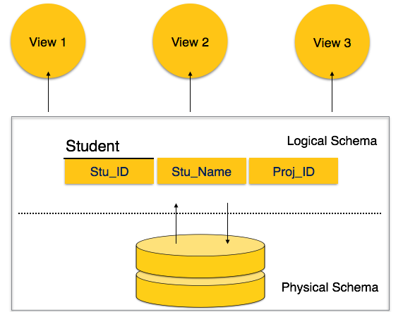

# Web Developer Notes
> Notes from CWDC-ZTM

## 	How The Internet Works

*	Developer Tools(Inspect Element)

	```
	tracert                          //generally shows for IPv6
	tracert-4 www.google.com         //Forces IPv4 Hops
	```

*	ISP, DNS and Servers
*	Traceroute (Windows: tracert)

	__PC>ISP>DNS-->**PC**__  
	__PC>GOOGLE SERVER --> **Files(html+css+js+...) to PC**__
	
	  
	__For Fast Transition between Browser and Google server__
	- Location of Server
	- How many Trips
	- Size of Files(html+css+js ..)
	
	
	
	<div align="center">
	<p><b>Client Side VS Server Side</b></p>
	</div>

*   [Submarine Cable Map](https://www.submarinecablemap.com/)


## 	History Of The Web

*    [Maps that explain the Internet](https://www.vox.com/a/internet-maps)

*    [First Webpage in the world](http://info.cern.ch/hypertext/WWW/TheProject.html)

##### Optional Videos: [Crash Course - Computer Science](https://www.youtube.com/watch?v=tpIctyqH29Q&list=PL8dPuuaLjXtNlUrzyH5r6jN9ulIgZBpdo&index=2&t=0s)


##   HTML 5

<table>
	<tr>
		<td><strong>Text Editors</strong></td>
		<td><a href='https://code.visualstudio.com/'>VS Code</a></td>
		<td><a href='https://www.sublimetext.com/'>Sublimetext</a></td>
		<td><a href='https://atom.io/'>Atom</a></td>
	</tr>
</table>

Tags:
*	`<html>`
*	`<head>`
*	`<title>`
*	`<body>`
*	headings (`h1`, `h2`, `h3`, `h4`, `h5`, `h6`)
*	paragraph `<p>`
*	bold `<strong>`, italic `<em>`
*	ordered list `<ol>`, unordered list `<ul>`, list item`<li>`
*	break `<br>`, horizontal rule `<hr>`
*	image `` and attributes: `src`, `width`, `height`
*	anchor `<a href="">`

Topics:
*	Relative vs Absolute Path

<table>
	<tr>
		<td><strong>Reference websites</strong></td>
		<td><a href='https://www.w3schools.com/'>W3 Schools</a></td>
		<td><a href='https://developer.mozilla.org/en-US/'>MDN Web Docs</a></td>
		<td><a href='https://stackoverflow.com/'>StackOverFlow</a></td>
	</tr>
</table>


## Advanced HTML 5


Tags:
*	`<form>`
	*	`method`, `action`
*	`<input>`:
	*	`type`= `"text"`, `"submit"`, `"reset"`, `"email"`, `"date"`, `"radio"`, `"password"`
	*	`required`, `value`, `name`, `min`, `placeholder`
*	dropdown `<select>`
	*	option `<option>`
*	comment `<!-- -->`
*	`<div>` and `<span>`

Semantic Elements
*	`<header>`
*	`<nav>`
*	`<main>`
*	`<footer>`

Topics:
*	Chrome View Source


## CSS

Syntax:
```css
Selector {
	property: value;
}
```

How to:
*	External
	```html
	<link rel="stylesheet type="text/css" href="style.css">
	```
*	Internal
	```html
	<style>
		body {
			background-color: purple;
		}
	</style>
	```
*	Inline
	```html
	<header style="background-color: green;">
	```

Tools:
*	Chrome Inspector
*	Css Minify - Compacting CSS code can save many bytes of data and speed up downloading, parsing, and execution time.

Properties:
*	text-align
*	border
*	background
*	list-style
*	cursor
*	color: html, hex, rgb or rgba

Selectors:
*	`.class`
*	`#id`
*	`*` (all elements)
*	`element`
*	`element, element`
*	`element element`
*	`element > element`
*	`element + element`
*	`v:hover`
*	`:last-child`
*	`:first-child`
*	`!important` (not recommended)

Text Properties
*	`text-decoration`
*	`text-transform`
*	`line-height`
*	`font-style`
*	`font-weight`
*	`font-size`
*	`font-family`

Layout Properties
*	`float` and `clear`

Box Model
*	`margin`
*	`border`
*	`padding`
*	`width` and `height`

Sizes
*	`px`
*	`em` and `rem`

Topics:
*	Cascading: Specificity, Importance `!`, Source Order
*	Linking fonts and external stylesheets

Exercises:
*	[Flukeout](https://flukeout.github.io/)

Reference websites:
*	[Css Tricks](https://css-tricks.com/)
*	[Type Terms](https://www.supremo.co.uk/typeterms/)
*	[FlexBox - Css Tricks](https://css-tricks.com/snippets/css/a-guide-to-flexbox/)
*	[Unsplash - free usable images](https://unsplash.com/)
* 	[Css Cascade&Inheritance - MDN Web docs](https://developer.mozilla.org/es/docs/Learn/CSS/Introduction_to_CSS/Cascada_y_herencia)
*	[Specificity Calculator](https://specificity.keegan.st/)

Website for color check:
*	[Paletton](http://paletton.com/)
*	[Coolors](https://coolors.co/)

Website for fonts download:
*	[Google Fonts](https://fonts.google.com/)


## Advanced CSS

Flexbox
*	`display: flex`
*	`flex-direction`
*	`flex-wrap`
*	`flex-flow`
*	`justify-content`
*	`align-items`
*	`align-content`
*	`order`
*	`flex`: `flex-grow`, `flex-shrink` and `flex-basis`
*	`align-self`

Properties
*	`transition`
*	`transform`
*	`box-shadow`


Tools
*	Chrome Toggle Device
*	[CodePen](https://codepen.io/)

Exercises:
*	[Flexboxfroggy](http://flexboxfroggy.com/)

Reference websites:
*	[Can I use](https://caniuse.com/)
*	[Browser Support - W3Schools](https://www.w3schools.com/cssref/css3_browsersupport.asp)
*	[Should I Prefix](http://shouldiprefix.com/)
*	[CSS Transitions and Transforms for Beginners](https://robots.thoughtbot.com/transitions-and-transforms)


## Bootstrap 4 & Templates

### [Bootstrap](https://getbootstrap.com/) : Search for Documentation

App for creating users list:
*	[MailChimp](https://mailchimp.com)


Website with animation examples(Generating animated patterns):
*	[Animate.Css](https://daneden.github.io/animate.css)

Website for patterns + Templates:
*	[Creative Tim - bootstrap themes](https://www.creative-tim.com/bootstrap-themes/ui-kit?direction=asc&sort=price)
*	[MashUp](http://mashup-template.com/templates.html)
*	[Startbootstrap](https://startbootstrap.com/template-categories/all/)
*	[Mdbootstrap](https://mdbootstrap.com/freebies/)
*	[Creative Tim](https://www.creative-tim.com/)

Installing Github:
*	[Github Desktop](https://desktop.github.com/)


## 	CSS Grid + CSS Layout


Cheat Sheet:
*	[Grid Malven](http://grid.malven.co/)
*	[Media Queries](https://css-tricks.com/snippets/css/media-queries-for-standard-devices/#phone-queries)
	* Example
```css
@media only screen and (max-width : 600px){
    .main-nav{
        font-size: 0.5em;
        padding: 0;
    }
}
```
**Normalize css** - provides better cross-browser consistency in the default styling of HTML elements.\
**Viewport Height `(vh)`** — This unit is based on the height of the viewport. A value of 1vh is equal to 1% of the viewport height.

Exercise:
*	[Grid Garden](https://cssgridgarden.com/)

Free Design & Illustration resources:
*	[Interfacer - high quality free design resources](https://interfacer.xyz/)
*	[Undraw - Open-source illustrations](https://undraw.co/)


## Javascript

#### JavaScript Engine
Each browser has its own JavaScript engine which is used to support the JavaScript scripts in order for them to work properly. Below are the names of the JavaScript engines used in some of the most popular browsers out there.  
```
Chrome        	: 		V8
Firefox       	: 		SpiderMonkey
Safari        	: 		JavaScript Core
Microsoft Edge	: 		Chakra
```


**JAVASCRIPT TYPES**
1. Number
```
> 10 + 2    //expression
> 12
---
> 10 - 2
> 8
---
> 2 * 2
> 4
---
> 10 / 2
> 5
---
> 10 % 3
> 1
---
> 5 % 10 
> 5
```
2. String
```
> "Hello" + "world!"
> "Helloworld1
---
> "Hello " + "world!"
> "Hello world1
---
> 'This isn\'t very nice'
> "This isn't very nice"
---
> 10 + "34"
> "1034"
---
> 10 - "7"
> 3
---
> "hello" - "bye"
> NaN     //means not a number
```
3. Boolean
```
> true
> false
---
> 3 > 2
> true
---
> 5>=5
> true
---
> 5<=5
> true
---
> 3 = 3
X error
---
> 3 === 3
> true
---
> 3!==3
> false
```
```
true + true    //  2
true + false   //  1
false + true   //  1
false - true   //  -1
"A" > "B"      //  false
"B" < "C"      //  true
"a" > "A"      //  true
"b" < "A"      //  false
```
4. Undefined
```
> var c;
___________
> c
> undefined
```
>JavaScript assigns 'undefined' to any object that has been declared but not initialized or defined. In other words, in a case where no value has been explicitly assigned to the variable, JavaScript calls it 'undefined'.
5. Null
6. Symbol (new in ECMAScript 6)
7. Object
  > `clear()` to clear up the console

**JAVASCRIPT COMPARISONS**
`!==`
`===`
`>=`
`<=`
`>`
`<`  

>= is used for assigning values to a variable in JavaScript. == is used for comparison between two variables irrespective of the datatype of variable. === is used for comparision between two variables but this will check strict type, which means it will check datatype and compare two values

**JAVASCRIPT VARIABLES**
* `var`
* `let` (new in ECMAScript 6)
* `const` (new in ECMAScript 6)

**JAVASCRIPT CONDITIONALS**
`if`
`else`
`else if`
`ternary operator`  // condition ? exp1 : exp2;
`switch`


**JAVASCRIPT LOGICAL OPERATORS**
`&&`
`||`
`!`

**JAVASCRIPT FUNCTIONS**
```javascript
var a = function name() {};   //function expression    //Anonymous function
---------------
function name() {}            //function declaration
return
---------------
function name(parameter) {  //sometime, parameters and arguments can be used interchangeably
console.log("name is :" + parameter);
}

name("steve");                //to call a function
name("Rob");
---------------
<!-- () => (new in ECMAScript 6) -->
```
DRY - DO NOT REPEAT YOURSELF  
> `console. log()` is a function in JavaScript which is used to print any kind of variables defined before in it or to just print any message that needs to be displayed to the user.

**JAVASCRIPT DATA STRUCTURES**
* Array
```javascript
list = ["apple","banana","orange"];
```
* Object
```javascript
var user = {
	name : "John",
	age : 24,
	hobby : "soccer",
}
// user.favouritefood = "spinach";
//user.hobby = "cricket";
```
**Array methods**

Method			|Description
-|-
`concat()`		|Joins two or more arrays, and returns a copy of the joined arrays
`copyWithin()`	|Copies array elements within the array, to and from specified positions
`entries()`		|Returns a key/value pair Array Iteration Object
`every()`		|Checks if every element in an array pass a test
`fill()`		|Fill the elements in an array with a static value
`filter()`		|Creates a new array with every element in an array that pass a test
`find()`		|Returns the value of the first element in an array that pass a test
`findIndex()`	|Returns the index of the first element in an array that pass a test
`forEach()`		|Calls a function for each array element
`from()`		|Creates an array from an object
`includes()`	|Check if an array contains the specified element
`indexOf()`		|Search the array for an element and returns its position
`isArray()`		|Checks whether an object is an array
`join()`		|Joins all elements of an array into a string
`keys()`		|Returns a Array Iteration Object, containing the keys of the original array
`lastIndexOf()`	|Search the array for an element, starting at the end, and returns its position
`map()`			|Creates a new array with the result of calling a function for each array element
`pop()`			|Removes the last element of an array, and returns that element
`push()`		|Adds new elements to the end of an array, and returns the new length
`reduce()`		|Reduce the values of an array to a single value (going left-to-right)
`reduceRight()`	|Reduce the values of an array to a single value (going right-to-left)
`reverse()`		|Reverses the order of the elements in an array
`shift()`		|Removes the first element of an array, and returns that element
`slice()`		|Selects a part of an array, and returns the new array
`some()`		|Checks if any of the elements in an array pass a test
`sort()`		|Sorts the elements of an array
`splice()`		|Adds/Removes elements from an array
`toString()`	|Converts an array to a string, and returns the result
`unshift()`		|Adds new elements to the beginning of an array, and returns the new length
`valueOf()`		|Returns the primitive value of an array


**JAVASCRIPT LOOPING**
* `for`
* `while`
* `do` 
* `forEach` (new in ECMAScript 5) 

**JAVASCRIPT KEYWORDS**
`break`
`case`
`catch`
`class`
`const`
`continue`
`debugger`
`default`
`delete`
`do`
`else`
`export`
`extends`
`finally`
`for`
`function`
`if`
`import`
`in`
`instanceof`
`new`
`return`
`super`
`switch`
`this`
`throw`
`try`
`typeof`
`var`
`void`
`while`
`with`
`yield`

**JAVASCRIPT POPUP BOXES**
`prompt`
`alert`

**DRY** - *Do not Repeat Yourself*


## DOM Manipulation
When a web page is loaded, the browser creates a Document Object Model of the page.  

*	`document.write()`
*	`window.alert()`

**DOM Selectors**

*	`getElementsByTagName`
*	`getElementsByClassName`
*	`getElementById`

*	`querySelector`
*	`querySelectorAll`

*	`getAttribute`
*	`setAttribute`

```javascript
/* Example */
---------------
document.querySelector("li").getAttribute("random");
---------------
document.querySelector("li").setAttribute("random","1000");
```
**Changing Styles**
*	`style.{property}` //ok

*	`className` //best
*	`classList` //best

	*	`classList.add`
	*	`classList.remove`
	*	`classList.toggle`
	
```javascript
document.querySelector("li").classList.toggle(  "classname"  );
```

**Bonus**
*	`innerHTML` //DANGEROUS

*	parentElement
*	children

```javascript
document.querySelectorAll("li")[1].parentElement.parentElement.children;
```

> It is important to CACHE selectors in variables
```javascript
var h1 = document.querySelector("h1");
//anytime user need to use h1, the browser doesn't have to look to DOM find h1 then store in the memory.
```

**Events**
*	`<Button>`
*	`addEventListener`
	*	`click`
	*	`mouseenter`
	*	`mouseleave`
*	`document.createElement("li")`

```javascript
//Example
var button = document.getElementById("enter");
var input = document.getElementById("userinput");
var ul = document.querySelector("ul");

button.addEventListener("click", function() {
	if(input.value > 0) {
		console.log(input.value);
		var li = document.createElement("li");
		li.appendChild(document.createTextNode(input.value));
		ul.appendChild(li);
		input.value = "";
	}
)};	
```


Reference websites:
*	[Event reference](https://developer.mozilla.org/en-US/docs/web/Events)
*	[Javascript Char Codes -Key Codes](https://www.cambiaresearch.com/articles/15/javascript-char-codes-key-codes)
*	[JQuery](https://jquery.com/)
*	[you might not need jquery](http://youmightnotneedjquery.com/)
*	[Babel - JavaScript compiler](https://babeljs.io/)

**Declarative programming** is a programming paradigm … that expresses the logic of a computation without describing its control flow.  
**Imperative programming** is a programming paradigm that uses statements that change a program’s state.

## 	__Advanced Javascript__

**Scope**
```javascript
//Root Scope(window)
var fun = 5;
function funestFunction(){
	//child scope
	console.log(fun);
}
```


```javascript
var globVar = "Hi";    //Global Scope[Exists everywhere]

function test () {
	var localVar = "Bye";   //Function Scope[Exists inside function only]

	console.log(globVar);   //Hi
	console.log(localVar);  //Bye

	function inside () {
		console.log(localVar);    //Lexical Scope[child function able to access parent variables]
	}

	for(let i=0; i<3; i++) {    //Block Scope[Exists only in block of code]
		console.log(globVar);   //Hi
		console.log(localVar);  //Bye
		console.log(i);  // 0, 1, 2
	}
	console.log(i);  //ERROR
}

console.log(globVar);  // Hi
console.log(localVar); //ERROR
console.log(i);  //ERROR

/*
__Local scope__
Anything that is not global is considered local, but subjective.  
*	var localVar is local variable of function test()
*	let i=0 is local variable of the block itself, it is not a local variable of function test()
*/
```

* ECMAScript6 and Javascript
> JavaScript is a language based on ECMAScript. A standard for scripting languages like JavaScript, JScript is ECMAScript. JavaScript is considered as one of the most popular implementations of ECMAScript.

*	let + const
```javascript
const player = 'booby';  //const variable cannot be reassigned
	// if using a variable that doesn't change probably use const ; otherwise use let.
let experience = 100;
let wizardLevel = false;

if(experience > 90) {
	let wizardLevel = true;
	console.log('inside', wizardLevel);  //inside true
}

console.log('outside', wizardLevel);         //outside true
```

*	Destructuring
```javascript
const obj = {
	player: 'bobby';
	experience : 100;
	wizarLevel : false
}
/*
const player = obj.player;
const experince = obj.experience;
let wizardLevel = obj.wizardLevel;
*/
// Below is same as above
const{player, experience } = obj;
let {wizardLevel } = obj;
```

*	Object Properties
```javascript
const a = "simon";
const b = true;
const c = {};
/*
const obj = {
	a:a, b:b, c:c
}
*/
const obj = {
	a, b, c
}
/*sometime you want properties to match the value. if property and value are same you can do this*/
```

*	Template Strings
```
>	const name = "Sally";
	const age = 34;
	const pet = "horse";

	/* const greetingBest = "Hello " + name + " you seem to be doing " + greeting + "!" */

	const greetingBest = `Hello ${name} you seem to be ${age-10}. What a lovely ${pet} you have`
	
-------------------------------------------
>	greetingBest
//	"Hello Sally you seem to be 24. What a lovely horse you have"
```

*	default arguments
```javascript
function greet(name='', age=30, pet ='cat'){
	return `Hello ${name} you seem to be ${age-10}. What a lovely ${pet} you have.`
}
/*
>	greet()
<-	Hello  you seem to be 20. What a lovely cat you have.
-------------------------------------------------------------
>	greet(name='john', age=30, pet ='cat');
<-	Hello john you seem to be 20. What a lovely cat you have.
*/
```

*	Symbol
```
//symbols are used because they create unique identity, so you could be sure that there is no conflict.
>	let sym1 = Symbol();
	let sym2 = Symbol('foo');
	let sym3 = Symbol('foo');
-------------------------------------------
>	sym1
//	Symbol()
-------------------------------------------
>	sym2
//	Symbol(foo)
-------------------------------------------
>	sym3
//	Symbol(foo)
-------------------------------------------
>	sym2 === sym3
//	false
```

**Arrow Function**  
```
>	function add(a, b) {
		return a+b;
	}
	//can be written as
	const add2 = (a,b) => a + b;
	/*
	const add2 = (a,b) => {
	return a + b;
	}
	*/
-------------------------------------------	
>	add(4,2);
//	6
-------------------------------------------
>	add2(4,2);
//	6
```

__Advanced function__
```javascript
/*
function first() {
	var greet = 'Hi';
	function second() {
		alert(great);
	}
	return second;
}

var newFunc = first();
newFunc();
*/

const first = () => {
	const greet = 'Hi';
	const second = () =>{
		alert(greet);
	}
	return second;
}

const newFunc = first();
newFunc();
```

**Closures**  
*child scope always has access to parent scope*  
Closures - a function ran. the function executed. It's never going to be execute again.  
BUT it's going to remember that there are refernces to those variables.  
so the child scope always has access to the parent scope.

**Currying**  
The process of converting a function that takes multiple arguments into a function that takes them one at a time.  
```
>	const multiply = (a, b) => a * b;
	const curriedMultiply = (a) => (b) => a * b;
-------------------------------------------	
>	curriedMultiply(3);
//	(b) => a * b
-------------------------------------------	
>	curriedMultiply(3)(4);   /*a is 3, b is 4*/
//	12
--------------------------------------------------------------------------------------	
--------------------------------------------------------------------------------------  
>	const curriedMultiply = (a) => (b) => a * b;
	const multiplyBy5 = curriedMultiply(5);
-------------------------------------------	
>	multiplyBy5(5);
//	25
-------------------------------------------	
>	multiplyBy5(11);
//	55

```

**Compose**
>act of putting two function together to form a third function where the output of one function is input of another function.  
```
const compose = (f,g) => (a) => f(g(a));
// f(g(a))  ->  f(sum(a))  ->  f(6)  -> sum(6)  ->  7
const sum = (num) => num + 1;

compose(sum, sum)(5);    //7
```

*Avoiding side Effects, functional purity.*   **(GOOD PRACTICE)**  

**Q. What are the two elements of a pure function?** 
1. Deterministic --> always produces the same results given the same inputs  
2. No Side Effects -->  It does not depend on any state, or data, change during a program’s execution. It must only depend on its input elements.

**Advanced Array**  
```javascript
const array = [1,2,10,16];
const double = [];
const newArray =array.forEach((num) => {
	double.push(num*2);
})
console.log(double);
// (4)	[2, 4, 20, 32]
```

**map, filter, reduce**  
```javascript
const array = [1,2,10,16];
const double = [];
const newArray =array.forEach((num) => {
	double.push(num*2);
})
console.log('forEach', double);  	// forEach	(4) [2, 4, 20, 32] 
//forEach - just to loop over something and does what function says
//in comparison to map. here, we have to create new array to return. no need to declare array seperately in map.
/*
const mapArray = array.map((num) => {
	return num*2
});
*/
//map - loop over each element and return new array.
const mapArray = array.map(num => num*2);
console.log('map', mapArray);	 	// map		(4) [2, 4, 20, 32]
//.map() returns a modified copy of the array leaving original untouched.

const filterArray = array.filter(num => num > 5);		
// filter the array where num(respective element in array) is greater than 5
console.log('filter', filterArray);	 // filter	(2) [10, 16]
//.filter() returns a modified copy of the array – the original is still available!

const reduceArray = array.reduce((accumulator, num) => {
	return accumulator + num
	//**accumulator**  - something where we can store the information that hapens in the body of function.
}, 0); //Accumulator is required to be set to a starting value. Here it is 0.
console.log('reduce', reduceArray);	//reduce 29

```

**reference type**  
```javascript
var object1 = {value: 10};
var object2 = object1; //object 2 reference object 1
var object3 = {value: 10};

object1 === object2;   // true
object1 === object3;   // false
object1.value = 15;    // 15
object2.value;         // 15
object3.value;         // 10
```

context (vs scope)  -  where we are within object
```javascript
const object4 = {
    a: function() {
        console.log(this);
    }
}

object4.a()   // {a:f}
```

**instantiation**  -  make a copy of object and reuse the code  
> A constructor is a function which is used to create instances, and automatically set their prototype.

```javascript
class Player {
	constructor(name, type) {
		console.log(this);
		this.name = name;
		this.type = type;
	}
	introduce() {
		console.log(`Hi I am ${this.name} , I'm a ${this.type}`);
	}
}

class Wizard extends Player { //class wizard that extends Player; whenever you extend a class you have to use super
	constructor(name, type) {
		super(name, type) //takes to the constructor of Player
	}
	play() {
		console.log(`WEEEEEE I'm a ${this.type}`);
	}
}

const wizard1 = new Wizard('shelly', 'Healer'); //makes instance of wizard
const wizard2 = new Wizard('shawn', 'Dark Magic');

/*OUTPUT:
Object { name: "shelly", type: "Healer" }
Object { name: "shawn", type: "Dark Magic" }

>	wizard1.play()
//	WEEEEEE I'm a Healer

>	wizard1.introduce()
//	Hi I am Shelly , I'm a Healer

>	wizard2.introduce()
//	Hi I am Shawn , I'm a Dark Magic 
*/
```

**Pass By value vs Pass By reference**  
```javascript
var a = 5;
var b = a;

b++;

console.log(a);//5
console.log(b);//6

//save space in memory
let obj1 = {name: 'Yao', password: '123'};
let obj2 = obj1;

obj2.password = 'easypeasy';

console.log(obj1);//{name: 'Yao', password: 'easypeasy'}
console.log(obj2);//{name: 'Yao', password: 'easypeasy'}

var c =[1,2,3,4,5];
var d =c;
d.push(123);
console.log(d);
console.log(c);

var c =[1,2,3,4,5];
var d =[].concat(c);
d.push(123);
console.log(d);//[1,2,3,4,5,123]
console.log(c);//[1,2,3,4,5]
```

```javascript
//shallow cloning
let obj = {a:'a', b:'b', c:'c'};
let clone = Object.assign({}, obj);  //{} means where to copy at  & obj means from where to copy
let clone2 = {...obj}; //above clone can also be written as
obj.c = 5;
console.log(clone);   //{a:'a', b:'b', c:'c'}
console.log(clone2);  //{a:'a', b:'b', c:'c'}
console.log(obj);     //{a:'a', b:'b', c:5}

//deep cloning -- can have performance implication if its extremely deep object
let obj = {a:'a', b:'b', c:{ deep : 'try and copy me'}};
let clone = Object.assign({}, obj);
let clone2 = {...obj}; 
let superclone = JSON.parse(JSON.strigify(obj))
obj.c.deep = 'hahaha';
console.log(obj);            //{a:'a', b:'b', c:{ deep : 'hahaha'}
console.log(clone);          //{a:'a', b:'b', c:{ deep : 'hahaha'}
console.log(clone2);         //{a:'a', b:'b', c:{ deep : 'hahaha'}
console.log(superclone);     //{a:'a', b:'b', c:{ deep : 'try and copy me'}}
```

**TYPE COERCION**  
```javascript
/*The difference between == and === is that: == converts the variable values to the same type before performing comparison. This is called type coercion. === does not do any type conversion (coercion) and returns true only if both values and types are identical for the two variables being compared.*/
1 == '1' //true
1 === '1' //false
Object.is(-0,+0)//true
NaN === NaN //false    ?NaN means Not a Number
```

##### Links   
*   [Type Coercion Table](https://dorey.github.io/JavaScript-Equality-Table/)  
*   [MDN - Equality comparisons](https://developer.mozilla.org/en-US/docs/Web/JavaScript/Equality_comparisons_and_sameness)  
*   [ECMA - Comparison Algorithm](https://www.ecma-international.org/ecma-262/5.1/#sec-11.9.3)

**ES7** 
```javascript
const pets = {'cat','dog','bat'};
pets.include('dog');   //true
pets.include('bird');  //false

const square = (x) =>x**2;  //similarly, x**3 will do cube for this.
square(5);  //25
```

**ES8**
*   `.padStart()`
*   `.padEnd()`
```javascript
Turtle.padStart(10);  // "     Turtle"
Turtle.padEnd(10);  // "Turtle     "
```

*   Object.values;
*   Object.entries;
*   Object.keys;

```javascript
let obj = {
	username0: 'Santa',
	username1: 'Rudolf',
	username2: 'Mr. Grinch',
}

Object.keys(obj).forEach((key, index) => {
	console.log(key, obj[key]);
})
/*username0 Santa
username1 Rudolf
username2 Mr. Grinch*/

Object.values(obj).forEach(value => {
	console.log(value);
})
/*Santa
Rudolf
Mr. Grinch*/

Object.entries(obj).forEach(value => {
	console.log(value);
})
/*(2) ["username0", "Santa"]
(2) ["username1", "Rudolf"]
(2) ["username2", "Mr. Grinch"]*/

```

**ES10**
*   `.flat()`
```javascript
const array = [1,2,,,,,,,3,4,[5,[6,7]],8];
array.flat(3);      // Array(8) [ 1, 2, 3, 4, 5, 6, 7, 8 ]
//.flat(how many layers you want to flatten);
```

*   `.flatMap`
*   `.trimStart()`
*   `.trimEnd()`
```javascript
const userEmail3 = '     cannotfillemailformcorrectly@gmail.com   ';
console.log(userEmail3.trimEnd().trimStart());  //cannotfillemailformcorrectly@gmail.com
```

*   `.formEntries()`
```
const users = { user1: 18273, user2: 92833, user3: 90315 }
//Solution
const usersArray = Object.entries(users);
console.log(usersArray); //array: [ [ 'user1', 18273 ], [ 'user2', 92833 ], [ 'user3', 90315 ] ]
```

*   try catch

**Advanced Loops** 
```javascript
//for of
const basket = ['apples', 'oranges', 'grapes'];
// iterating - arrays,strings
for (item of basket) {
    console.log(item);   //apples, oranges, grapes
}

for (item of 'apple'){
	console.log(item);
}
// a
// p
// p
// l
// e

//for in - properties
//enumerating - objects
const detailedBasket = {
    apples : 5,
    oranges : 10,
    grapes : 1000
}
for (item in detailedBasket) {
    console.log(item);  
    /*
    apples
    oranges
    grapes
    */
}


/* suppose enumeration done on array(for in performed on array)*/
// for (item in basket) {
//     console.log(item);  
//     /*
//     0
//     1
//     2
//     */
// }
```

*   Debugging `debugger;`

**How does Javascript works?**  
*   Terms:  
    `Javascript is a single threaded laguage that can be non blocking??`  
    `Memory Leak`  
    `Call Stack - first in last out`  
    `synchronous Programming`  
    `Asynchronous Programming`  
    `Recursion - function calling itself`  
    `.setTimeout()`  
    
Modules    
*   Code Reusability
*   Dependency Resolution

**Links**   
*   [ES modules: A cartoon deep-dive](https://hacks.mozilla.org/2018/03/es-modules-a-cartoon-deep-dive/)
*   [Modern JavaScript Tutorial](https://javascript.info/)
*   [JavaScript. The Core: 2nd Edition](http://dmitrysoshnikov.com/ecmascript/javascript-the-core-2nd-edition/)


##  __Command Line__

### FOR MAC OR LINUX:

Command 					| 	Description
--- 						| 	---
ls  						| 	lists files and folders within working directory
pwd 						| 	show current working directory
cd  						| 	change working directory to user directory
cd .. 						| 	change working directory to direct parent directory
clear 						| 	clear current terminal screen
cd / 						| 	change current directory to root directory
cd ~ 						| 	change current directory to user directory
cd path/to/folder 			| 	changes working directory to specified path
mkdir name 					| 	create folder called 'name' within current directory
open foldername 			| 	opens folder called 'foldername' using OS GUI
touch index.html 			| 	creates new file titled index.html within working directory
open  index.html 			| 	opens file named index.html using default system program
open -a “Sublime Text”		| 	opens sublime text program. This syntax can be used to open other programs
open . 						| 	opens and displays current folder within OS GUI
mv index.html about.html	| 	renames index.html file to about.html
up and down arrow 			| 	cycles through previous commands typed within current terminal session
rm filename 				| 	deletes a file called 'filename' within the current directory
rm -r foldername 			| 	used to delete folders. In this case 'foldername' will be deleted
say hello (only on Mac) 	| 	the mac will speak any text you enter after the 'say' keyword


### FOR WINDOWS:

cmd | 	What it does
-- 	| 	--
dir	| 	list files
cd {directory name}	| 	change directory
cd /	| 	go to root (top) directory
cd ..	| 	go up a level
mkdir {file name}	| 	make a directory
echo > {filename}	| 	create an empty file
del {filename}		| 	remove a file
rmdir {directory name}				| remove a directory and all files within
rename {filename} {new filename}	| 	rename a file or folder
start {filename}	| 	open file in default program
start .	| 	open current directory
cls		| 	clear the terminal screen
tree	| 	display directories and subdirectories as a nesting tree


## 	__Git + Github + Open Source Projects__

[Install Git](https://www.atlassian.com/git/tutorials/install-git)  


Command | Description
-- | --
`git config –global user.name "[name]"`   	| 	This command sets the author name respectively to be used with your commits.
`git config –global user.email "[email address]"`	| 	Sets the email address respectively to be used with your commits.
`git clone "[url]"` 	| 	Create a local copy of a remote repository.
`git status`  			| 	This command lists all the files that have to be committed.
`git add "[filename]"`  | 	Add a file to the staging area.
`git add .`   						| 	This command adds one or more to the staging area.
`git commit -m "[commit message]"`  | 	Commit changes.
`git push `   | 	Push changes to remote repository (remembered branch).
`git pull`    | 	Update local repository to the newest commit.
`git branch`  | 	To list out all the branches in the project.
`git branch "[branch-name]"`  		| 	create a new branch at the current commit.
`git checkout "[branch-name]"` 		| 	Switch to a branch.
`git checkout -b "[branch-name]"`	| 	Create a new branch and switch to it.
`git merge "[branch-name]" `   		| 	Merge a branch into the active branch.
`git diff`    | 	Shows the file differences which are not yet staged.
`git push origin "[branch name]"`   | 	Push a branch to your remote repository.
`git init "[repository name]"`  	| 	To start a new repository.
`git rm -r "[file-name.txt]" `		| 	Remove a file (or folder)


Do you have to always fork the Open Source project every time master get's updated? What happens if somebody makes an update to the original project and now your forked project is out of sync and outdated? Luckily for you, there is an easy way to always make sure your fork has the most up to date version of the original project. Here is how:

Once you are in your forked project directory in your command prompt....


1.	Type `git remote -v` and press Enter. You'll see the current configured remote repository for your fork.
	```
	git remote -v
	origin  https://github.com/YOUR_USERNAME/YOUR_FORK.git (fetch)
	origin  https://github.com/YOUR_USERNAME/YOUR_FORK.git (push)
	```

2.	Type `git remote add upstream`, and then paste the URL you would copy from the original repository if you were to do a git clone. Press Enter. It will look like this:
	```
	git remote add upstream https://github.com/zero-to-mastery/PROJECT_NAME.git
	```

3.	To verify the new upstream repository you've specified for your fork, type `git remote -v` again. You should see the URL for your fork as `origin`, and the URL for the original repository as `upstream`.
	```
	git remote -v
    origin    https://github.com/YOUR_USERNAME/YOUR_FORK.git (fetch)
    origin    https://github.com/YOUR_USERNAME/YOUR_FORK.git (push)
    upstream  https://github.com/ORIGINAL_OWNER/ORIGINAL_REPOSITORY.git (fetch)
    upstream  https://github.com/ORIGINAL_OWNER/ORIGINAL_REPOSITORY.git (push)
	```

4.	Now, you can keep your fork synced with the upstream repository with a few Git commands.
	One simple way is to do the below command from the master of your forked repository:
	```
	git pull upstream master
	```


## 	__NPM + NPM Scripts__
*npm is the world's largest Software Registry.Open-source developers use npm to share software.*  

`node -v`	: To check if you have Node.js installed, run this command in your terminal.  
`npm -v`	: To confirm that you have npm installed you can run this command in your terminal.  

**npm versions**
npm is a separate project from Node.js, and tends to update more frequently. As a result, even if you’ve just downloaded Node.js (and therefore npm), you’ll probably need to update your npm. Luckily, npm knows how to update itself!   
To update your npm, type this into your terminal:	`npm install npm@latest -g`  

While using npm or node commands, if you ever get permission issue, you may need to run the commands with `sudo` in front of each command.  

Command						|	what it does
--							|	--
`npm init`					|	create package.json file
`npm install`				|	install npm package locally
`npm install –g browserify`	|	install npm package globally

Install node and npm:
*	[What is npm?](https://www.w3schools.com/whatis/whatis_npm.asp)
*	[NodeJs](https://nodejs.org/)
*	[Get npm!](https://www.npmjs.com/get-npm)

Reference websites:
*	[npm js](https://www.npmjs.com/)
*	[npm react package](https://www.npmjs.com/package/react)
*	[lodash](https://lodash.com/)
*	[npm semver calculator](https://semver.npmjs.com/)


## 	__React.js__


```
npm install –g create-react-app
create-react-app “name”
npm start
npm install tachyons
```
### npm install
To trigger the installation of all modules that are listed as dependencies and devDependencies in the package.json in the current directory. To do so, you'll simply need to run the command itself:
```
npm install
```
Once you run this, npm will begin the installation process of all of the current project's dependencies. 

### Create-react-app
```
npx create-react-app my-app
cd my-app
npm start
```
>If you've previously installed create-react-app globally via npm install -g create-react-app, we recommend you uninstall the package using npm uninstall -g create-react-app to ensure that npx always uses the latest version.

### What is package.json?
`package.json` is a plain JSON(Java Script Object Notation) text file which contains all metadata information about Node JS Project or application.  
Every Node JS Package or Module should have this file at root directory to describe its metadata in plain JSON Object format.  
We should use same file name with same case “package” and same file extension “*.json”.  
> Why that filename is “package”: because Node JS platform manages every feature as separate component. That component is also known as “Package” or “Module”.    

### Who uses package.json file?
**NPM (Node Package Manager)** uses this package.json file information about Node JS Application information or Node JS Package details.
package.json file contains a number of different directives or elements. It uses these directives to tell NPM “How to handle the module or package”.

```json
//in package.JSON file
"scripts": {
    "start": "react-scripts start",	//reads the react scripts  - npm start
    "build": "react-scripts build",
    "test": "react-scripts test",
    "eject": "react-scripts eject"	//use eject when you want to customize the project and go your own way
  },
```

### .gitignore
A `gitignore` file specifies intentionally untracked files that Git should ignore. Files already tracked by Git are not affected;  
Each line in a gitignore file specifies a pattern. When deciding whether to ignore a path, Git normally checks `gitignore` patterns from multiple sources.  

### What Is JSX?
JSX is an XML/HTML-like syntax used by React that extends ECMAScript so that XML/HTML-like text can co-exist with JavaScript/React code. The syntax is intended to be used by preprocessors *(i.e., transpilers like Babel)* to transform HTML-like text found in JavaScript files into standard JavaScript objects that a JavaScript engine will parse.  

Basically, by using JSX you can write concise HTML/XML-like structures *(e.g., DOM like tree structures)* in the same file as you write JavaScript code, then Babel will transform these expressions into actual JavaScript code. Unlike the past, instead of putting JavaScript into HTML, JSX allows us to put HTML into JavaScript.  

That's why we use `import React from 'react';` so that it could read html like syntax.

### What is a service worker?
A service worker is a script that your browser runs in the background, separate from a web page, opening the door to features that don't need a web page or user interaction.  


### When should I use curly braces for ES6 import?
This is a **default import**:
```javascript
// B.js
import A from './A'
```
It only works if `A` has the **default export**:
```javascript
// A.js
export default 42
```
In this case it doesn’t matter what name you assign to it when importing:
```javascript
// B.js
import A from './A'
import MyA from './A'
import Something from './A'
```  
Because it will always resolve to whatever is the **default export** of `A`.

---   
This is a **named import called** `A`:
```javascript
import { A } from './A'
```
It only works if `A` contains a **named export called** `A`:
```javascript
export const A = 42
```
In this case the name matters because you’re importing **a specific thing by its export name:**
```javascript
// B.js
import { A } from './A'
import { myA } from './A' // Doesn't work!
import { Something } from './A' // Doesn't work!
```
---  
To make these work, you would add a **corresponding named export** to `A`:
```javascript
// A.js
export const A = 42
export const myA = 43
export const Something = 44
```
A module can only have **one default export**, but **as many named exports as you'd like** (zero, one, two, or many). You can import them all together:
```javascript
// B.js
import A, { myA, Something } from './A'
```
Here, we import the default export as A, and named exports called `myA` and `Something`, respectively.
```javascript
// A.js
export default 42
export const myA = 43
export const Something = 44
```
We can also assign them all different names when importing:
```javascript
// B.js
import X, { myA as myX, Something as XSomething } from './A'
```
The default exports tend to be used for whatever you normally expect to get from the module. The named exports tend to be used for utilities that might be handy, but aren’t always necessary. However it is up to you to choose how to export things: for example, a module might have no default export at all.  
[This is a great guide to ES modules, explaining the difference between default and named exports.](https://2ality.com/2014/09/es6-modules-final.html)

**`npm start`**	Runs the app in the development mode.  
**`npm test`**	Launches the test runner in the interactive watch mode.   
**`npm run build`**	Builds the app for production to the `build` folder. It correctly bundles React in production mode and optimizes the build for the best performance.   
**`npm audit`**	Scan your project for vulnerabilities and just show the details, without fixing anything  
**`npm audit fix`**	Scan your project for vulnerabilities and automatically install any compatible updates to vulnerable dependencies  
**`npm audit fix --force`**	Have audit fix install semver-major updates to toplevel dependencies, not just semver-compatible ones  

Links:
*	[create-react-app](https://www.npmjs.com/package/create-react-app)
*	[Overview of create-react-app](https://github.com/facebook/create-react-app)
*	[create-react-app updated list](https://reactjs.org/blog/2018/10/01/create-react-app-v2.html)
*	[create-react-app documentation](https://create-react-app.dev/docs/getting-started/)
*	[What is npx](https://medium.com/@maybekatz/introducing-npx-an-npm-package-runner-55f7d4bd282b)
*	[Robohash](https://robohash.org)
*	[Tachyons](https://tachyons.io/)
*	[Service Workers: an Introduction](https://developers.google.com/web/fundamentals/primers/service-workers/)
*	[React.Fragment and Semantic HTML](http://blog.jmes.tech/react-fragment-and-semantic-html/)
*	[Handling Events](https://reactjs.org/docs/handling-events.html)
*	[JavaScript String toLowerCase() Method](https://www.w3schools.com/jsref/jsref_tolowercase.asp)
*	[JavaScript String includes() Method](https://www.w3schools.com/jsref/jsref_includes.asp)
*	[Sega Logo Font](https://www.cufonfonts.com/font/sega-logo-font)
*	[Using @font-face](https://css-tricks.com/snippets/css/using-font-face/)
*	[Fetch API](https://developer.mozilla.org/en-US/docs/Web/API/Fetch_API)
*	[React.Component](https://reactjs.org/docs/react-component.html)
*	[Deployment-Create React App](https://create-react-app.dev/docs/deployment/)  

**Action --> Reducer --> Store --> Make changes**


## __HTTP/JSON/AJAX + Asynchronous Javascript__

### HTTP
The Hypertext Transfer Protocol (HTTP) is designed to enable communications between clients and servers.  
HTTP works as a request-response protocol between a client and server.  
A web browser may be the client, and an application on a computer that hosts a web site may be the server.  
Example: A client (browser) submits an HTTP request to the server; then the server returns a response to the client. The response contains status information about the request and may also contain the requested content.  

HTTP Methods|What it does?
-|-
GET|GET is used to request data from a specified resource.
POST|POST is used to send data to a server to create/update a resource.
PUT|PUT is used to send data to a server to create/update a resource.
DELETE|The DELETE method deletes the specified resource.

**HTTP status messages that might be returned**

<table>
<tr>
<td>1xx: Information</td>
<td>2xx: Successful</td>
<td>3xx: Redirection</td>
<td>4xx: Client Error</td>
<td>5xx: Server Error</td>
</tr>
</table>

When a browser requests a service from a web server, an error might occur, and the server might return an error code like 404 Not Found. It is common to name these errors HTML error messages.  
But these messages are something called HTTP status messages. In fact, the server always returns a message for every request. The most common message is 200 OK.  


**Routing** refers to determining how an application responds to a client request to a particular endpoint, which is a URI (or path) and a specific HTTP request method (GET, POST, and so on). Each **route** can have one or more handler functions, which are executed when the **route** is matched.

### JSON JavaScript Object Notation
JSON is a syntax for storing and exchanging data. JSON is text, written with JavaScript object notation.

**`JSON.stringify()`**  
A common use of JSON is to exchange data to/from a web server.  
When sending data to a web server, the data has to be a string.  
Convert a JavaScript object into a string with `JSON.stringify()`.  

**`JSON.parse()`**  
A common use of JSON is to exchange data to/from a web server.  
When receiving data from a web server, the data is always a string.  
Parse the data with `JSON.parse()`, and the data becomes a JavaScript object.

### AJAX [Asynchronous JavaScript And XML] 
AJAX is not a programming language.  
AJAX just uses a combination of:  
+	A browser built-in XMLHttpRequest object (to request data from a web server)  
+	JavaScript and HTML DOM (to display or use the data)

>AJAX is a misleading name. AJAX applications might use XML to transport data, but it is equally common to transport data as plain text or JSON text.  

```javascript
//Fetch
fetch('/my/url').then(response => {
	console.log(response);
});
```
**AJAX** allows web pages to be updated asynchronously by exchanging data with a web server behind the scenes. This means that it is possible to update parts of a web page, without reloading the whole page.

#### PROMISE 
A **`Promise`** is an object that may produce a single value some time in the future: either a resolved value, or a reason that it’s not resolved (e.g., a network error occurred). A promise may be in one of 3 possible states: fulfilled, rejected, or pending.

*Promises are used to handle asynchronous operations in JavaScript. They are easy to manage when dealing with multiple asynchronous operations where callbacks can create callback hell leading to unmanageable code.*

Prior to promises events and callback functions were used but they had limited functionalities and created unmanageable code. Multiple callback functions would create callback hell that leads to unmanageable code.  

A `Promise` is in one of these states:

+	**fulfilled**: *meaning that the operation completed successfully.*  
	`onFulfilled()` will be called (e.g., `resolve()` was called)
+	**rejected**: *meaning that the operation failed.*  
	`onRejected()` will be called (e.g., `reject()` was called)
+	**pending**: *initial state, neither fulfilled nor rejected.*

```javascript
const promise = new Promise((resolve, reject) => {
  //asynchronous code goes here
});
```

**Promise Consumers:** Promises can be consumed by registering functions using .then and .catch methods.  
`then()` is invoked when a promise is either resolved or rejected.  
`catch()` is invoked when a promise is either rejected or some error has occured in execution.  

**NOTE:**  
*In computer science, **syntactic sugar** is syntax within a programming language that is designed to make things easier to read or to express. It makes the language "sweeter" for human use: things can be expressed more clearly, more concisely, or in an alternative style that some may prefer.*

--- 

#### ASYNC/AWAIT
The purpose of `async`/`await` is to simplify using promises synchronously, and to perform some behavior on a group of `Promises`. As `Promises` are similar to structured callbacks, `async`/`await` is similar to combining generators and promises.

---
#### TRY/CATCH/FINALLY
The **try/catch/finally** statement handles some or all of the errors that may occur in a block of code, while still running code.  
Errors can be coding errors made by the programmer, errors due to wrong input, and other unforeseeable things.   

The **try** statement allows you to define a block of code to be tested for errors while it is being executed.  
The **catch** statement allows you to define a block of code to be executed, if an error occurs in the try block.
The **finally** statement lets you execute code, after try and catch, regardless of the result. 

**Note:** The `catch and finally statements are both optional`, but you need to use one of them (if not both) while using the try statement.

**Tip:** When an error occurs, JavaScript will normally stop, and generate an error message. Use the `throw` statement to create a custom error (throw an exception). If you use **throw** together with **try** and **catch**, you can control program flow and generate custom error messages.

```javascript
try {
  tryCode - Block of code to try
}
catch(err) {
  catchCode - Block of code to handle errors
}
finally {
  finallyCode - Block of code to be executed regardless of the try / catch result
}

// err 	
// Required if used with catch. Specifies a local variable that refers to the error. 
// The variable can refer to the Error object (contains information about the occurred error, like the message "'addlert' is not defined"). 
// If the exception was created by the throw statement, the variable refers to the object specified in the throw statement
```

```javascript
//Example: examines input. If the value is wrong, an exception (err) is thrown.
// The exception (err) is caught by the catch statement and a custom error message is displayed:
<!DOCTYPE html>
<html>
<body>

<p>Please input a number between 5 and 10:</p>

<input id="demo" type="text">
<button type="button" onclick="myFunction()">Test Input</button>
<p id="message"></p>

<script>
function myFunction() {
  var message, x;
  message = document.getElementById("message");
  message.innerHTML = "";
  x = document.getElementById("demo").value;
  try { 
    if(x == "")  throw "is Empty";
    if(isNaN(x)) throw "not a number";
    if(x > 10)   throw "too high";
    if(x < 5)  throw "too low";
  }
  catch(err) {
    message.innerHTML = "Input " + err;
  }
}
</script>

</body>
</html>
```

#### ES9 `Object spread operator`
```
const animals = {
	tiger: 23,
	lion: 5,
	monkey:2
}

const {tiger, ...rest} = animals;
----------------------------------
>> tiger
<< 23
----------------------------------
>> rest
<< Object { lion: 5, monkey: 2 }

----------------------------------
----------------------------------

const array = [1,2,3,4,5];
function sum (a, b, c, d, e) {
	return a+b+c+d+e;
}
----------------------------------
>>	sum(...array);
<<	15
----------------------------------
>>	sum(1,2,3,4,5)   // same as above for ES6
<<	15
```
**[ECMAScript-new-features-list](https://github.com/daumann/ECMAScript-new-features-list)**

## __Backend Basics__

Backend development languages handle the 'behind-the-scenes' functionality of web applications. It's code that connects the web to a database, manages user connections, and powers the web application itself. Backend development works in tandem with the front end to deliver the final product to the end user.


## __APIs__

An **API** application program interface is a set of routines, protocols, and tools for building software applications. Basically, an API specifies how software components should interact. Additionally, APIs are used when programming graphical user interface (GUI) components. A good API makes it easier to develop a program by providing all the building blocks. A programmer then puts the blocks together.

*Here is a real-life **API example**. You may be familiar with the process of searching flights online. Just like the restaurant, you have a variety of options to choose from, including different cities, departure and return dates, and more. Let us imagine that you’re booking you are flight on an airline website. You choose a departure city and date, a return city and date, cabin class, as well as other variables. In order to book your flight, you interact with the airline’s website to access their database and see if any seats are available on those dates and what the costs might be.*

*However, what if you are not using the airline’s website––a channel that has direct access to the information? What if you are using an online travel service, such as Kayak or Expedia, which aggregates information from a number of airline databases?*

*The travel service, in this case, interacts with the airline’s API. The API is the interface that, like your helpful waiter, can be asked by that online travel service to get information from the airline’s database to book seats, baggage options, etc. The API then takes the airline’s response to your request and delivers it right back to the online travel service, which then shows you the most updated, relevant information.*

Links:
*	[API List...](https://apilist.fun/)
*	[PUBLIC API's](https://public-apis.xyz/)
*	[SWAPI - The Star Wars API](http://swapi.py4e.com/)
*	[Numbers API](http://numbersapi.com/#24)
*	[chucknorris.io](https://api.chucknorris.io/)
*	[PokéAPI - The RESTful Pokémon API](https://pokeapi.co/)
*	[International Space Station Current Location](http://open-notify.org/Open-Notify-API/ISS-Location-Now/)


##	__Node.js + Express.js__

```
//script2.js
const largenumber = 356;

module.exports = {
    largenumber: largenumber
};
/*-----------------------------------*/

//script.js
const script2 = require ('./script2.js') //module you created yourself

const a =script2.largenumber;
const b = 4;

console.log(a+b);                       // node script.js in terminal
```

#### Built-in modules in NodeJs

**fs** - File System Module  
`const c = require('fs').readFile`  Outputs content of file.  
`const c = require('http');` this module is used to build Server.  

`node <scriptfile.js>` write this to run script file.   
`npm init -y` to make sure to have package.JSON file. here,`-y` will say yes to all the prompts  
`npm install nodemon --save--dev`	nodemon in dev dependencies; only be used when developing. it will not be uploaded on servers.

**To Create Server**
```javascript
const http = require('http');

const server = http.createServer(() => {
    console.log('hello');
});

server.listen(3000);
```

**`npm start` to view the response whereas nodemon is used to respond to file changes**

```javascript
//Building Servers
const http = require('http');

const server = http.createServer((request, response) => {
    console.log('header' , request.header)
    console.log('method', request.method)
    console.log('url' , request.url)

    // response.setHeader('content-Type','text/html');
    // response.end('<h1>Helloooo</h1>');
    
    const user = {
        name: 'john',
        hobby: 'skating'
    }
    response.setHeader('content-Type','application/json');
    response.end(JSON.stringify(user)); //{"name":"john","hobby":"skating"}
});

server.listen(3000);
```

**[Express js - Documentation](https://expressjs.com/)**  
**Routing** refers to how an application’s endpoints (URIs) respond to client requests.

`npm install express` to install express package.  

```js
//express server
const express = require('express');

const app = express();

//get request - route
app.get('/',(req, res) => {
    // res.send('Helloooooo');
    res.send("<h1>Helloooooo</h1>");

});
app.listen(3000);
```

```js
//express server using JSON
const express = require('express');

const app = express();

//get request
app.get('/',(req, res) => {  // here '/' depicts the route
    const user = {
        name:'john',
        age:21,
    }

    res.send(user); //automatically Stringify the JSON, reduces repetition
});
app.listen(3000); //on refersh of localhost, or on request it displays {"name":"john","age":21}
```
---
```js
const express = require('express');

const app = express();

app.get('/',(req, res) => {
    res.send("getting root");  //http://localhost:3000/
});

app.get('/profile',(req, res) => {
    res.send("getting profile"); //http://localhost:3000/profile/
});

app.post('/',(req, res) => {
    const user = {
        name:'sally',
        age:'soccer',
    }

    res.send(user); 
});

app.listen(3000);
```

#### Middleware
**Middleware** functions are functions that have access to the request object *(req)*, the response object *(res)*, and the *next* function in the application’s **request-response cycle**. The next function is a function in the Express router which, when invoked, executes the middleware succeeding the current middleware.  

Middleware functions can perform the following tasks:  
+	Execute any code.
+	Make changes to the request and the response objects.
+	End the request-response cycle.
+	Call the next middleware in the stack.

```js
const express = require('express');
const app = express();

app.use((req, res, next) => {    //app. use() is an middleware method
  console.log('LOGGED')
  next();
})

app.get('/', (req, res) => {
  res.send('Hello World!')
});

app.listen(3000);
```
Every time the app receives a request, it prints the message “LOGGED” to the terminal.  
The order of middleware loading is important: middleware functions that are loaded first are also executed first.  
If *myLogger* is loaded after the route to the root path, the request never reaches it and the app doesn’t print “LOGGED”, because the route handler of the root path terminates the request-response cycle.  
The middleware function myLogger simply prints a message, then passes on the request to the next middleware function in the stack by calling the next() function.

Link:
+	[PostMan](https://www.postman.com/downloads/) platform for API development.  

Node.js body parsing middleware.  
Parse incoming request bodies in a middleware before your handlers, available under the req.body property.  
`npm install body-parser`

```js
// IN PostMan selct the response as urlencoded or JSON file raw file format
const express = require('express');
const bodyParser = require('body-parser');

const app = express();

app.use(bodyParser.urlencoded({extended : false}));//for encoded
app.use(bodyParser.json());//for JSON

// you can also use, this is also in in Express 4.16+
// app.use(express.urlencoded({extended: false}));
// app.use(express.json());

app.get('/',(req, res) => {
    res.send("getting root");  //http://localhost:3000/
});

app.get('/profile',(req, res) => {
    res.send("getting profile"); //http://localhost:3000/profile/
});

app.post('/profile',(req, res) => {
    console.log(req.body);

    res.send('success'); //response will be success 
});

app.listen(3000);
//PUT is used for updating
//DELETE to delete the user
```

#### RestfulAPI
A RESTful API is an application program interface (API) that uses HTTP requests to GET, PUT, POST and DELETE data. An API for a website is code that allows two software programs to communicate with each other.  

```js
const express = require('express');
const bodyParser = require('body-parser');

const app = express();

app.use(bodyParser.urlencoded({extended : false}));
app.use(bodyParser.json());

app.get('/:id',(req, res) => {
    // console.log(req.query); //localhost:3000/?name=jack&age=31
    // req.body
    // req.headers
    console.log(req.params) //for example: localhost:/1234
    res.status(404).send("not found"); 
});

app.listen(3000);

```

---
```js
//serves simple static assets
const express = require('express');
const bodyParser = require('body-parser');

const app = express();
app.use(express.static(__dirname + '/public')) //gives the file path

app.listen(3000);

```

#### NODE File System Module
```js
const fs = require('fs'); ///readFile is Asynchronous
//if file doesn't exist, it will create file for us.
fs.readFile('./hello.txt', (err,data) => { //read the file and respod accordigly.
    console.time('timecalculate');
    if(err){
        console.log('errooooorrrrr');
    }
    console.log('1', 'Async', data.toString('utf8')); //utf-8 is form of encoding
    console.timeEnd('timecalculate'); // calculte the execution time.

})

const file = fs.readFileSync('./hello.txt'); //Synchronous
console.log('2', 'Sync', file.toString());

// APPEND
// fs.appendFile('./hello.txt', 'This is so cool!', err => {  //appends given text to the file
//     if(err){
//         console.log(err);
//     }
// })

// WRITE
// fs.writeFile('bye.txt', 'sad to see you', err => {
//     if(err) { 
//         console.log(err)
//     }
// });

// DELETE
fs.unlink('./bye.txt', err => {
    if(err){
        console.log(err)
    }
    console.log('Inception');
});
```


#### Back-End -- Server

[Change localhost](https://stackoverflow.com/questions/40714583/how-to-specify-a-port-to-run-a-create-react-app-based-project)

If you don't want set environment variable, other option - modify scripts part of package.json from: `"start": "react-scripts start"`  

or (maybe) more general solution by to:`"start": "export PORT=3006 react-scripts start"`  

Windows solution to:`"start": "set PORT=3006 && react-scripts start"`

**Front-end:**

```Javascript
fetch('http://localhost:3000/image', {
	method: 'put',
	headers: {'Content-Type': 'application/json'},
	body: JSON.stringify({
		id: this.state.user.id
	})
})
.then(response => response.json())
.then(count => {
	this.setState(Object.assign(this.state.user, { entries:count}))
})
```

**Back-end:**

```Javascript
const cors = require('cors')
app.use(cors());
```


##	__Databases__

**Database** is an organized collection of data, so that it can be easily accessed and managed.  
You can organize data into tables, rows, columns, and index it to make it easier to find relevant information.  
**Database handlers** create a database in such a way that only one set of software program provides access of data to all the users.  

The **main purpose** of the database is to operate a large amount of information by storing, retrieving, and managing data. There are many **dynamic websites** on the World Wide Web nowadays which are handled through databases. For example, a model that checks the availability of rooms in a hotel. It is an example of a dynamic website that uses a database.

There are many databases available like [PostgreSQL](https://www.postgresql.org/), MySQL, Oracle, MongoDB etc.  

Modern databases are managed by the **database management system (DBMS)**.  
**SQL** or **Structured Query Language** is used to operate on the data stored in a database. SQL depends on relational algebra and tuple relational calculus. 

#### RDBMS (Relational Database Management System)

The word **RDBMS** is termed as **Relational Database Management System**. It is represented as a table(also known as relations) that contains rows and column.  

RDBMS is based on the Relational model;  
A relational database contains the following components:  

+	Table
+	Record/ Tuple
+	Field/Column name /Attribute
+	Instance
+	Schema
+	Keys

An RDBMS is a tabular DBMS that maintains the **ACID** accuracy, consistency, integrity, and security of the data.  

**Primary key** uniquely identify a record in the table. **Foreign key** is a field in the table that is primary key in another table. **Primary Key** can't accept null values. **Foreign key** can accept multiple null value.

#### What is NoSQL ?

**NoSQL** is an upcoming category of Database Management Systems. Its main characteristic is its non-adherence to Relational Database Concepts. **NOSQL** means **Not only SQL**. 

Concept of NoSQL databases grew with internet giants such as Google, Facebook, Amazon etc who deal with gigantic volumes of data.

When you use relational database for massive volumes of data , the system starts getting slow in terms of response time. To overcome this , we could of course "scale up" our systems by upgrading our existing hardware.  

The alternative to the above problem would be to distribute our database load on multiple hosts as the load increases. This is known as "scaling out".  

*NOSQL database are non-relational databases that scale out better than relational databases and are designed with web applications in mind.*  

>They do not use SQL to query the data and do not follow strict schemas like relational models.With NoSQL, ACID (Atomicity, Consistency, Isolation, Durability) features are not guaranteed always   

#### Database Schema
A database schema is the **skeleton structure that represents the logical view of the entire database**. It defines how the data is organized and how the relations among them are associated. It formulates all the constraints that are to be applied on the data.

A database schema **defines its entities and the relationship among them**. It contains a **descriptive detail of the database**, which can be depicted by means of schema diagrams. It’s the database designers who design the schema to help programmers understand the database and make it useful.

  


DBMS|RDMS
-|-
DBMS applications store data as file.|RDBMS applications store data in a tabular form.
In DBMS, data is generally stored in either a hierarchical form or a navigational form.|In RDBMS, the tables have an identifier called primary key and the data values are stored in the form of tables.
Normalization is not present in DBMS.|Normalization is present in RDBMS.
DBMS does not apply any security with regards to data manipulation.|RDBMS defines the integrity constraint for the purpose of ACID (Atomocity, Consistency, Isolation and Durability) property.
DBMS uses file system to store data, so there will be no relation between the tables.|In RDBMS, data values are stored in the form of tables, so a relationship between these data values will be stored in the form of a table as well.
DBMS has to provide some uniform methods to access the stored information.|RDBMS system supports a tabular structure of the data and a relationship between them to access the stored information.

#### Separation of Concerns
In computer science, **separation of concerns (SoC)** is a design principle for separating a computer program into distinct sections such that each section addresses a separate concern. A concern is a set of information that affects the code of a computer program.  


#### Set Path For PostgreSQL in Windows

1. Search **env** it shows **Edit environment variables for your account**  
2. Select **Environment Variables**  
3. From the System Variables box select **PATH**  
4. Click **New** (to add new path)  

Change the PATH variable to include the **bin** directory of your PostgreSQL installation.  
then add new path their....[for example]
```
C:\Program Files\PostgreSQL\12\bin
```

After that click **OK**

Open **CMD/Command Prompt**. Type this to open *psql*
```
psql -U username database_name
```  
*For Example `psql -U postgres test`*

Now, you will be prompted to give **Password** for the User. *(It will be hidden as a security measure).*

Then you are good to go.
-----------------------------------------------------------------------------------------


//opening a database in command line
psql -U postgres database_name
```sql
psql -U postgres test
```

//Create a database
CREATE DATABASE database_name;

//Create a table
CREATE TABLE table_name (column_1 datatype, column_2 datatype, column_3 datatype);

//to delete a table
DROP TABLE table_name;

//Connect to a database:
\c database_name;

//Show all datatables:
\l

//to show list of relations in cmd (describe database)
\d

//EXIT - to go back to the terminal
\q

//List all users in postgresSQL database server:
\du

//List all tables in a schema:
\d+ schema_name.*

//Insert Data
INSERT INTO table_name (column-1, column_2, column_3) VALUES (value_1, 'value_2', value_3);
```
INSERT INTO users (name, age, birthday) VALUES ('john', 21, '1980-01-25');
```

//to view table contents (Show all information of a table)
SELECT * FROM table_name;
```
SELECT * FROM users;
```

//to view selected column of table contents
SELECT columname1, columnname2 FROM table_name;

//to Add a column to an existing table
ALTER TABLE table_name ADD column datatype;
```
ALTER TABLE users ADD score smallint;
```

//to ALTER and update
UPDATE table_name
SET some_column = some_value
WHERE some_column = some_value;

```
UPDATE users SET score = 50 WHERE name='john';
UPDATE users SET score = 100 WHERE name='sally' AND name='jared';
UPDATE users SET score = 100 WHERE name='sally' OR name='jared';
```


-------------------------
//Conditionals
```
SELECT * FROM users WHERE name LIKE 'j%';
SELECT * FROM users WHERE name LIKE '%y';
```

//show the table as per the scores in decending order
```
SELECT * FROM users ORDER BY score DESC;
SELECT * FROM users ORDER BY score ASC;
```

//functions
SELECT AVG(score) FROM users;
SELECT SUM(age) FROM users;
SELECT count(name) FROM users;


//create a table
CREATE TABLE login (
	ID serial NOT NULL PRIMARY KEY,
	secret VARCHAR (100) NOT NULL,
	name text UNIQUE NOT NULL
);


//JOIN tables
```
//example
SELECT * FROM users JOIN login ON users.name = login.name;
```

//Delete data from the table
```
DELETE FROM users WHERE name='rob';
```

Delete column from a table:
```
ALTER TABLE test DROP COLUMN age;
```

//delete a table
DROP TABLE table_name;
```SQL
DROP TABLE login;
DROP TABLE users;
```

//Delete a database:
DROP DATABASE database_name;

//List a table in a schema:
\d+ schema_name . table_name


##	__Production + Deployment__


Environmental variables:
*	http://www.dowdandassociates.com/blog/content/howto-set-an-environment-variable-in-windows-command-line-and-registry/

#### PORT

On terminal:

	bash
	-->PORT-3000 node server.js

On server.js:
```JSX
	const PORT = process.env.PORT
	app.listen(PORT, ()=>{
		console.log(`app is running on port ${PORT}`);
	})
```

#### DATABASE

On terminal:

	bash
	-->DATABASE_URL-123  node server.js

On server.js:

```jsx
	const DATABASE_URL = process.env. DATABASE_URL
	app.listen(3000, ()=>{
		console.log(`app is running on port ${ DATABASE_URL }`);
	})
```

#### OTHER OPTION

On terminal:

	fish
	-->env DATABASE_URL-‘hello’ node server.js

#### Deploy apps:
Heroku:  
*	https://www.heroku.com/
*	https://devcenter.heroku.com/articles/git


Commands for heroku on backend folder:
Install heroku:
```
npm install -g heroku
heroku login
heroku create
```
In the terminal there will be a URL : ” https://limitless-bastion-10041.herokuapp.com/”
```
git remote –v
git push origin master
heroku git: remote –a limitless-bastion-10041
```

Changes required in:

*	BACK END: PORT in server.js needs to be changed by an environment variable
*	FRONT END: fetch URL needs to be changed by the URL of HEROKU + “:3000”

```
git push heroku master
for checking errors:
heroku logs --tail
heroku open
```


Connect to pg database:
*	https://devcenter.heroku.com/articles/heroku-postgresql
*	https://docs.aws.amazon.com/es_es/AmazonRDS/latest/UserGuide/USER_ConnectToPostgreSQLInstance.html
*	https://msdn.microsoft.com/en-us/library/ms175043(v=sql.120).aspx#SSMSProcedure

Create a new postgres database using Heroku:

Data: Heroku postgres: create new: install heroku postgres: select the app created
```
heroku addons
heroku info
heroku pg:psql
```
